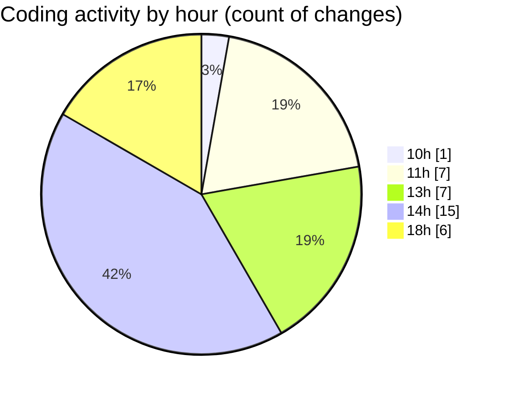

# nxtqube_webapp - Activity Summary 

## Overall Statistics

| Stat                   | Value                                                             |
| ---------------------- | ----------------------------------------------------------------- |
| **Lines Added** (➕)   | 1621                                          |
| **Lines Removed** (➖) | 182                                        |
| **Net Change** (↕)    | 1439                |
| **Active Time** (⌚)   | 47 minutes |

## Modified Files
- **create3DMission.tsx** (+582, -70)
- **MissionTypeSelector.tsx** (+63, -4)
- **StackMissionControl.tsx** (+582, -103)
- **createGridMission.tsx** (+394, -5)

## Visualizations

### By File Type (Lines Changed)

### By Hour (Estimated Activity Count)

> **Last Updated:** 18/03/2026, 18:31:27