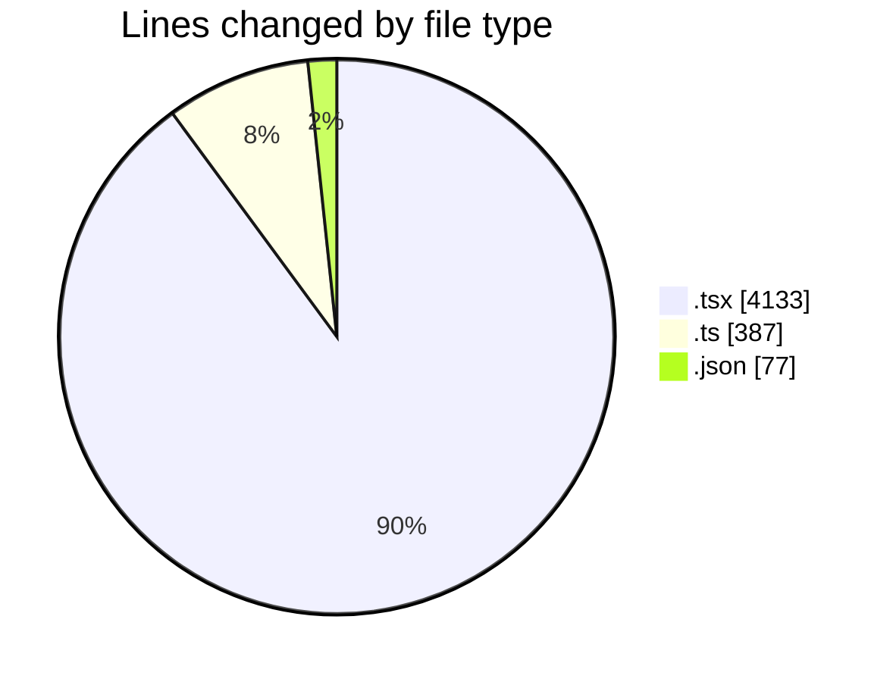
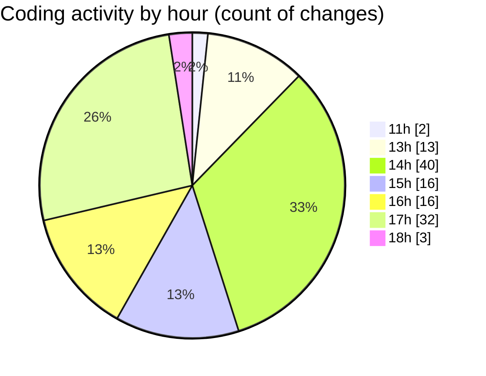

# nxtqube_webapp - Activity Summary 

## Overall Statistics

| Stat                   | Value                                                             |
| ---------------------- | ----------------------------------------------------------------- |
| **Lines Added** (➕)   | 4162                                          |
| **Lines Removed** (➖) | 435                                        |
| **Net Change** (↕)    | 3727                |
| **Active Time** (⌚)   | 150 minutes |

## Modified Files
- **StackMissionControl.tsx** (+642, -95)
- **StackMission3D.tsx** (+450, -0)
- **create3DMission.tsx** (+798, -186)
- **Mission3DPlanner.tsx** (+597, -135)
- **use.polygon.geofence.3d.ts** (+112, -13)
- **OrbitMission3D.tsx** (+365, -0)
- **MissionPages.tsx** (+264, -0)
- **store.ts** (+154, -0)
- **Mission3DControl.tsx** (+161, -3)
- **MissionTypeSelector.tsx** (+73, -2)
- **OrbitMissionControl.tsx** (+361, -1)
- **settings.json** (+77, -0)
- **draw.stack.boundry.ts** (+108, -0)

## Visualizations

### By File Type (Lines Changed)

### By Hour (Estimated Activity Count)

> **Last Updated:** 22/03/2026, 18:08:19