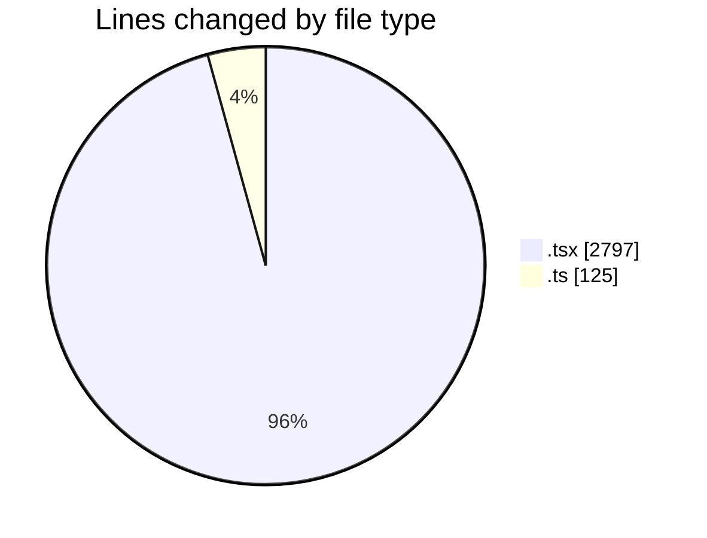
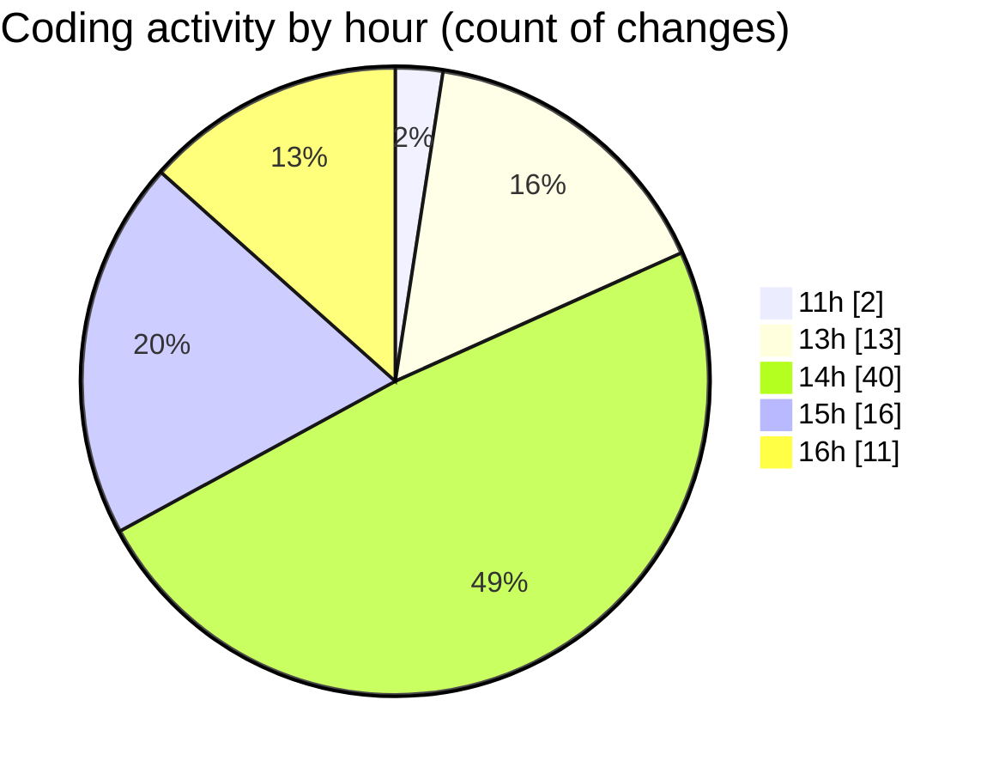

# nxtqube_webapp - Activity Summary 

## Overall Statistics

| Stat                   | Value                                                             |
| ---------------------- | ----------------------------------------------------------------- |
| **Lines Added** (➕)   | 2553                                          |
| **Lines Removed** (➖) | 369                                        |
| **Net Change** (↕)    | 2184                |
| **Active Time** (⌚)   | 105 minutes |

## Modified Files
- **StackMissionControl.tsx** (+642, -95)
- **StackMission3D.tsx** (+450, -0)
- **create3DMission.tsx** (+752, -145)
- **Mission3DPlanner.tsx** (+597, -116)
- **use.polygon.geofence.3d.ts** (+112, -13)

## Visualizations

### By File Type (Lines Changed)

### By Hour (Estimated Activity Count)

> **Last Updated:** 22/03/2026, 16:30:01