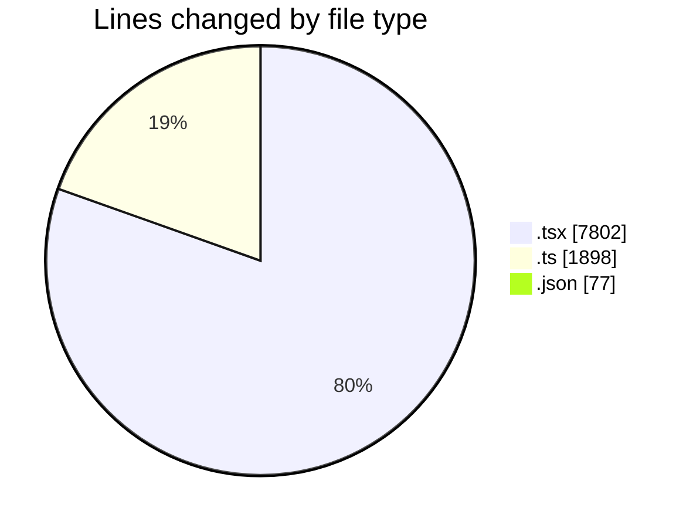
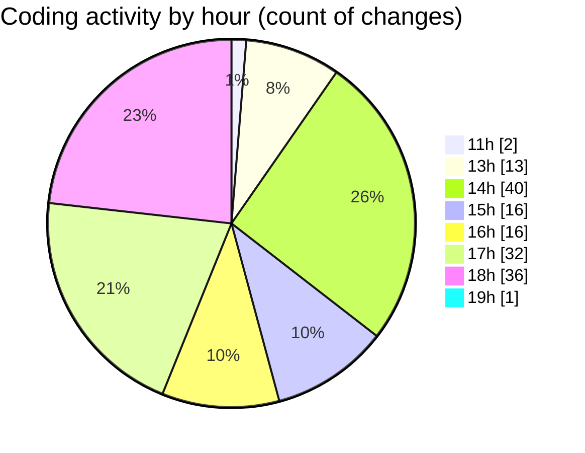

# nxtqube_webapp - Activity Summary 

## Overall Statistics

| Stat                   | Value                                                             |
| ---------------------- | ----------------------------------------------------------------- |
| **Lines Added** (➕)   | 9148                                          |
| **Lines Removed** (➖) | 629                                        |
| **Net Change** (↕)    | 8519                |
| **Active Time** (⌚)   | 186 minutes |

## Modified Files
- **StackMissionControl.tsx** (+642, -95)
- **StackMission3D.tsx** (+450, -0)
- **create3DMission.tsx** (+798, -186)
- **Mission3DPlanner.tsx** (+597, -135)
- **use.polygon.geofence.3d.ts** (+112, -13)
- **OrbitMission3D.tsx** (+365, -0)
- **MissionPages.tsx** (+264, -0)
- **store.ts** (+154, -0)
- **Mission3DControl.tsx** (+161, -3)
- **MissionTypeSelector.tsx** (+73, -2)
- **OrbitMissionControl.tsx** (+361, -1)
- **settings.json** (+77, -0)
- **draw.stack.boundry.ts** (+108, -0)
- **stackMissionUtils.ts** (+186, -167)
- **CesiumMap.tsx** (+4, -0)
- **createGridMission.tsx** (+389, -5)
- **MissionActions.tsx** (+34, -0)
- **MissionControls.tsx** (+466, -0)
- **MissionStats.tsx** (+91, -0)
- **useGridMission.ts** (+800, -0)
- **missionDataHandler.ts** (+169, -0)
- **index.ts** (+7, -0)
- **gridMissionUtils.ts** (+182, -0)
- **createPathMission.tsx** (+868, -22)
- **DeleteMission.tsx** (+64, -0)
- **WaypointAction.tsx** (+922, -0)
- **MissionInfo.tsx** (+628, -0)
- **AppLayout.tsx** (+176, -0)

## Visualizations

### By File Type (Lines Changed)

### By Hour (Estimated Activity Count)

> **Last Updated:** 22/03/2026, 19:13:19