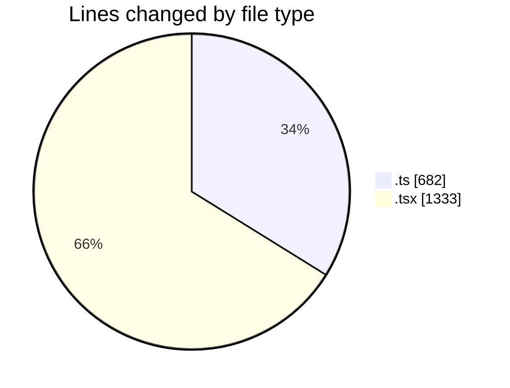
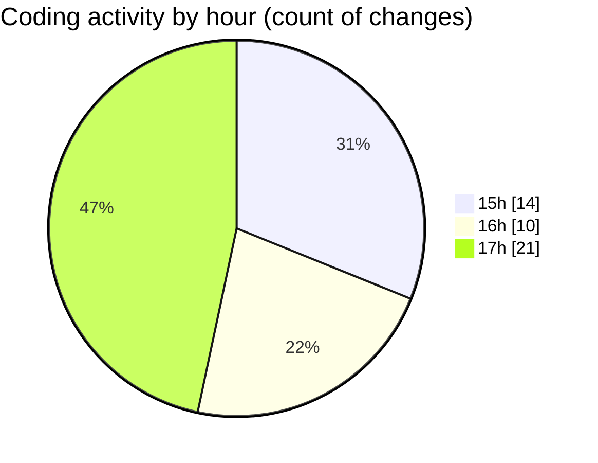

# nxtqube_webapp - Activity Summary 

## Overall Statistics

| Stat                   | Value                                                             |
| ---------------------- | ----------------------------------------------------------------- |
| **Lines Added** (➕)   | 1862                                          |
| **Lines Removed** (➖) | 153                                        |
| **Net Change** (↕)    | 1709                |
| **Active Time** (⌚)   | 72 minutes |

## Modified Files
- **use.polygon.geofence.ts** (+509, -0)
- **StackMission3D.tsx** (+592, -119)
- **missionDataHandler.ts** (+173, -0)
- **StackMissionControl.tsx** (+588, -34)

## Visualizations

### By File Type (Lines Changed)

### By Hour (Estimated Activity Count)

> **Last Updated:** 23/03/2026, 17:08:28