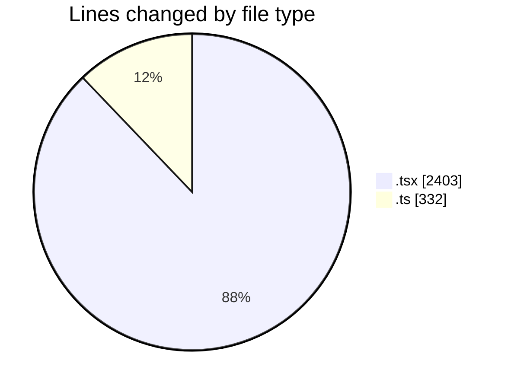
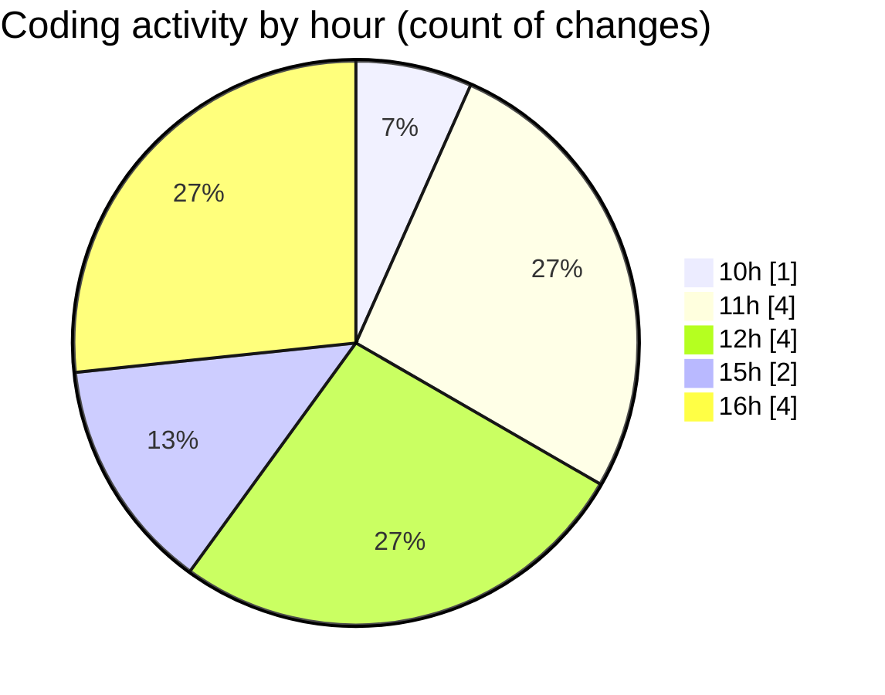

# nxtqube_webapp - Activity Summary 

## Overall Statistics

| Stat                   | Value                                                             |
| ---------------------- | ----------------------------------------------------------------- |
| **Lines Added** (➕)   | 2730                                          |
| **Lines Removed** (➖) | 5                                        |
| **Net Change** (↕)    | 2725                |
| **Active Time** (⌚)   | 17 minutes |

## Modified Files
- **create3DMission.tsx** (+381, -0)
- **createPathMission.tsx** (+846, -0)
- **draw.stack.boundry.ts** (+332, -0)
- **StackMissionControl.tsx** (+705, -0)
- **StackMission3D.tsx** (+466, -5)

## Visualizations

### By File Type (Lines Changed)

### By Hour (Estimated Activity Count)

> **Last Updated:** 24/03/2026, 16:04:57