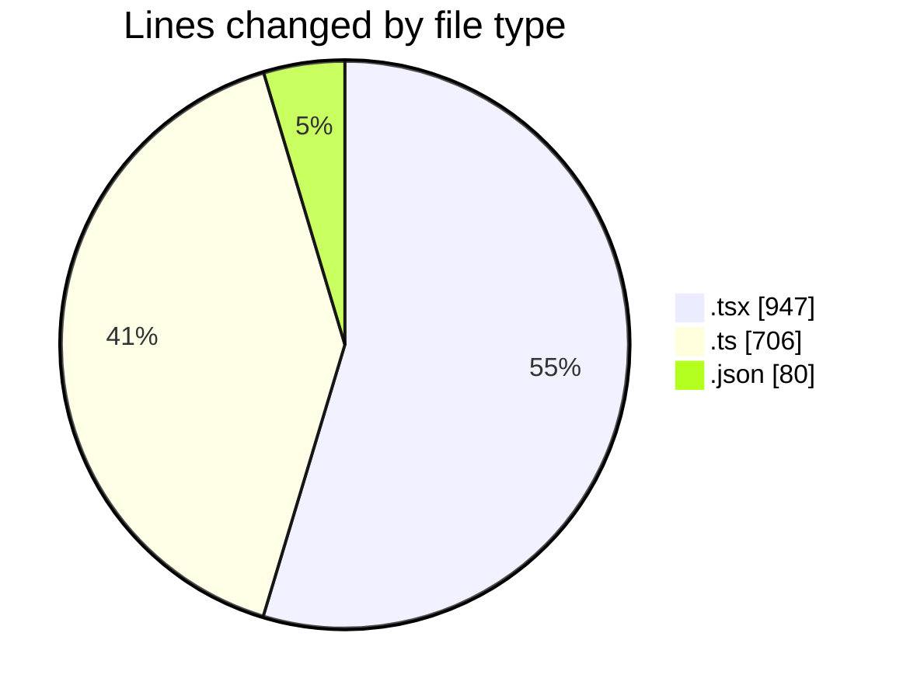
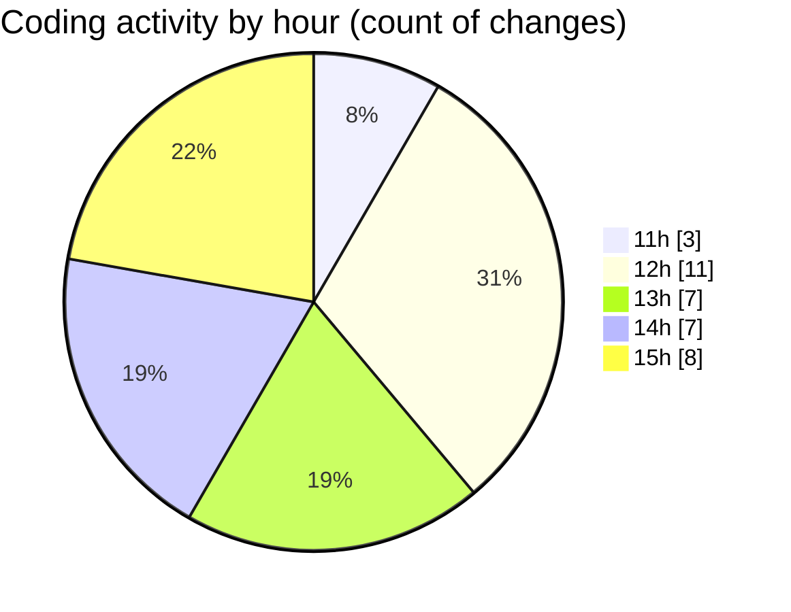

# nxtqube_webapp - Activity Summary 

## Overall Statistics

| Stat                   | Value                                                             |
| ---------------------- | ----------------------------------------------------------------- |
| **Lines Added** (➕)   | 1635                                          |
| **Lines Removed** (➖) | 98                                        |
| **Net Change** (↕)    | 1537                |
| **Active Time** (⌚)   | 36 minutes |

## Modified Files
- **StackMission3D.tsx** (+23, -19)
- **StackMissionControl.tsx** (+43, -65)
- **create3DMission.tsx** (+796, -1)
- **draw.stack.boundry.ts** (+156, -0)
- **use.polygon.geofence.ts** (+537, -13)
- **settings.json** (+80, -0)

## Visualizations

### By File Type (Lines Changed)

### By Hour (Estimated Activity Count)

> **Last Updated:** 25/03/2026, 15:45:43