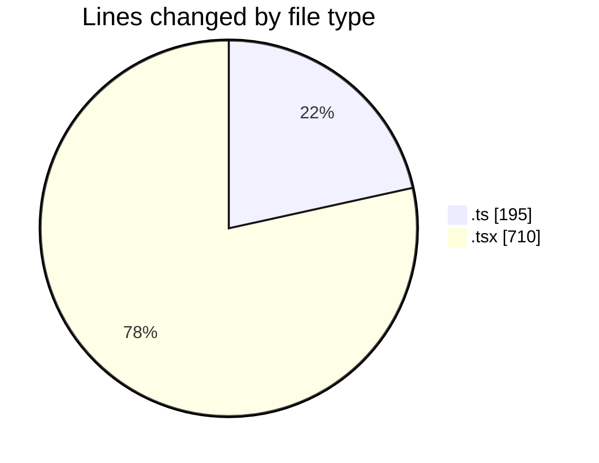
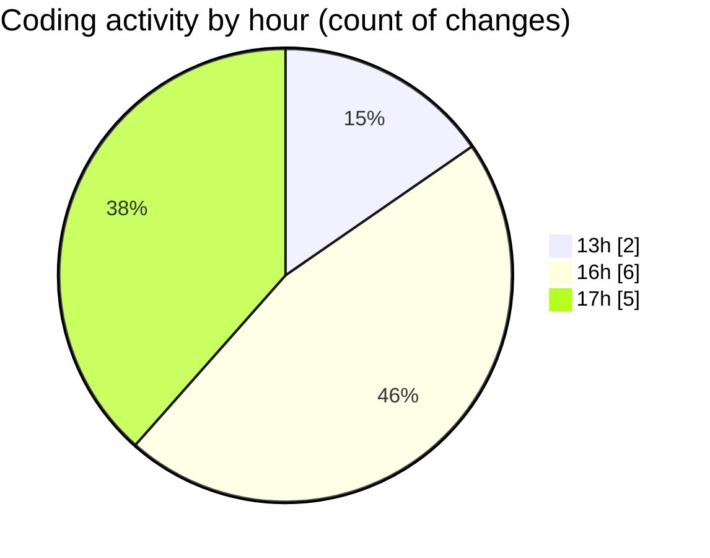

# nxtqube_webapp - Activity Summary 

## Overall Statistics

| Stat                   | Value                                                             |
| ---------------------- | ----------------------------------------------------------------- |
| **Lines Added** (➕)   | 879                                          |
| **Lines Removed** (➖) | 26                                        |
| **Net Change** (↕)    | 853                |
| **Active Time** (⌚)   | 12 minutes |

## Modified Files
- **draw.stack.boundry.ts** (+181, -14)
- **StackMissionControl.tsx** (+698, -12)

## Visualizations

### By File Type (Lines Changed)

### By Hour (Estimated Activity Count)

> **Last Updated:** 26/03/2026, 17:33:52