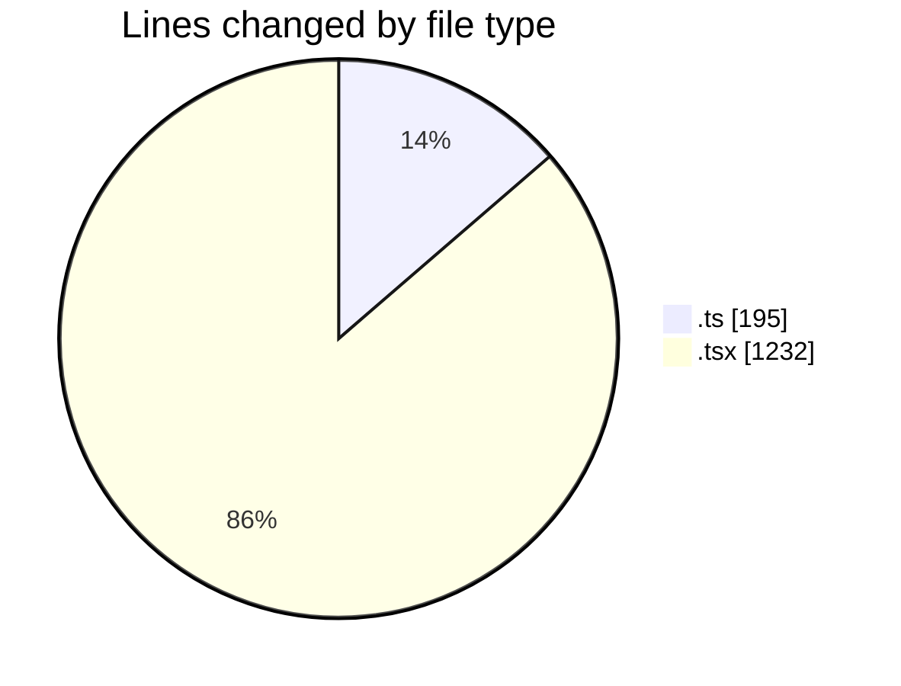
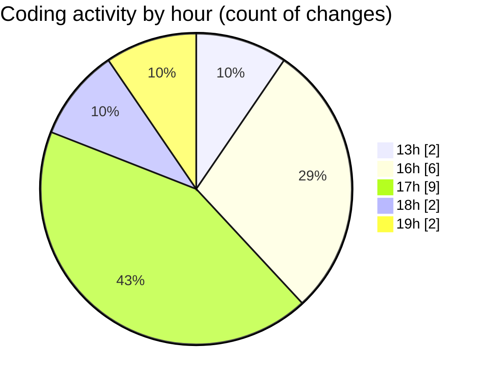

# nxtqube_webapp - Activity Summary 

## Overall Statistics

| Stat                   | Value                                                             |
| ---------------------- | ----------------------------------------------------------------- |
| **Lines Added** (➕)   | 1398                                          |
| **Lines Removed** (➖) | 29                                        |
| **Net Change** (↕)    | 1369                |
| **Active Time** (⌚)   | 20 minutes |

## Modified Files
- **draw.stack.boundry.ts** (+181, -14)
- **StackMissionControl.tsx** (+698, -12)
- **StackMission3D.tsx** (+519, -3)

## Visualizations

### By File Type (Lines Changed)

### By Hour (Estimated Activity Count)

> **Last Updated:** 26/03/2026, 19:01:39