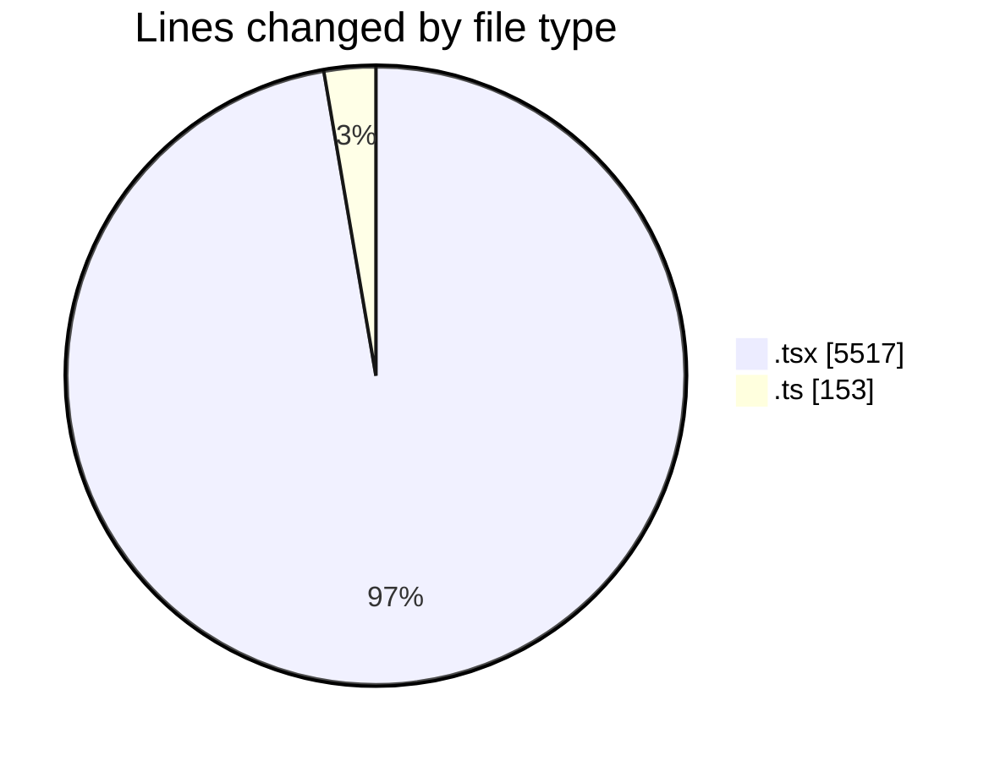
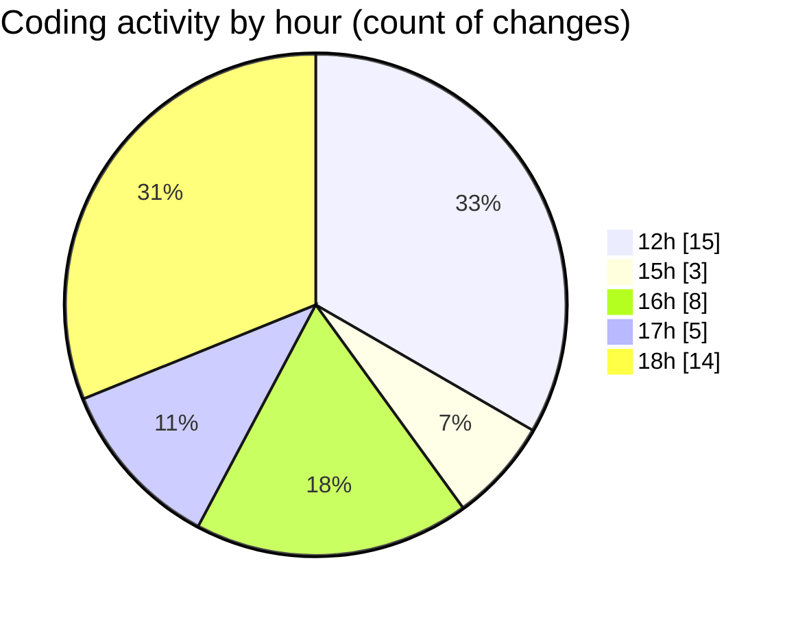

# nxtqube_webapp - Activity Summary 

## Overall Statistics

| Stat                   | Value                                                             |
| ---------------------- | ----------------------------------------------------------------- |
| **Lines Added** (➕)   | 4350                                          |
| **Lines Removed** (➖) | 1320                                        |
| **Net Change** (↕)    | 3030                |
| **Active Time** (⌚)   | 55 minutes |

## Modified Files
- **StackMission3D.tsx** (+627, -13)
- **draw.stack.boundry.ts** (+153, -0)
- **create3DMission.tsx** (+884, -46)
- **StackMissionControl.tsx** (+964, -11)
- **OrbitMission3D.tsx** (+790, -600)
- **OrbitMissionControl.tsx** (+932, -650)

## Visualizations

### By File Type (Lines Changed)

### By Hour (Estimated Activity Count)

> **Last Updated:** 27/03/2026, 18:15:24