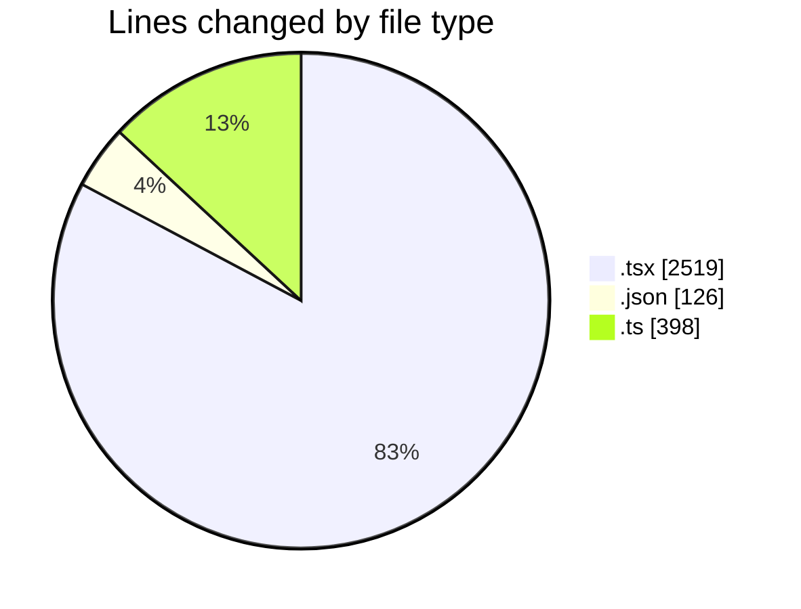
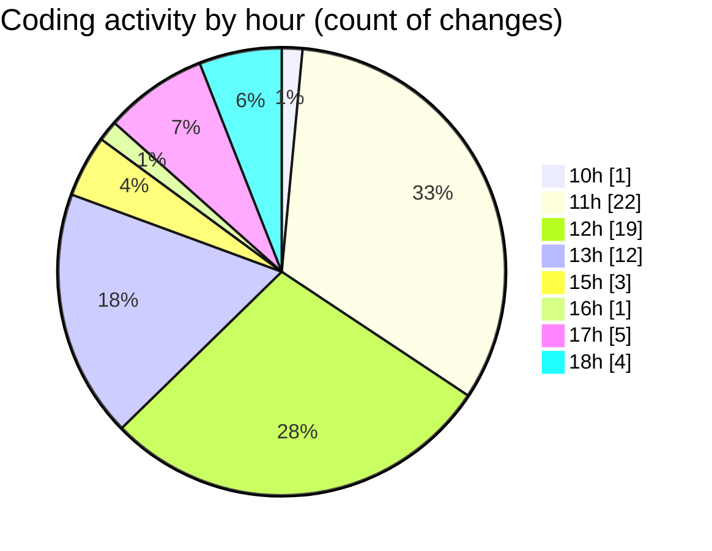

# nxtqube_webapp - Activity Summary 

## Overall Statistics

| Stat                   | Value                                                             |
| ---------------------- | ----------------------------------------------------------------- |
| **Lines Added** (➕)   | 2532                                          |
| **Lines Removed** (➖) | 511                                        |
| **Net Change** (↕)    | 2021                |
| **Active Time** (⌚)   | 85 minutes |

## Modified Files
- **OrbitMissionControl.tsx** (+449, -95)
- **create3DMission.tsx** (+338, -273)
- **MissionInfo.tsx** (+1001, -17)
- **save.json** (+106, -20)
- **save.ts** (+292, -106)
- **StackMissionControl.tsx** (+204, -0)
- **MissionTypeSelector.tsx** (+71, -0)
- **MissionModeSelector.tsx** (+71, -0)

## Visualizations

### By File Type (Lines Changed)

### By Hour (Estimated Activity Count)

> **Last Updated:** 30/03/2026, 18:46:37