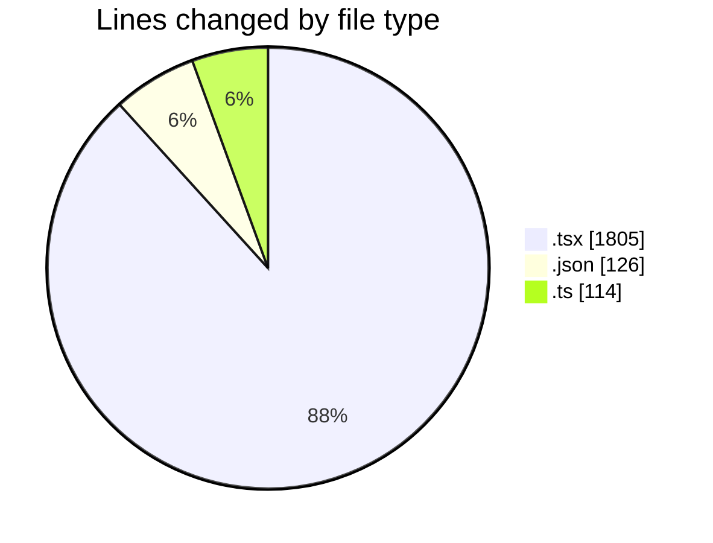
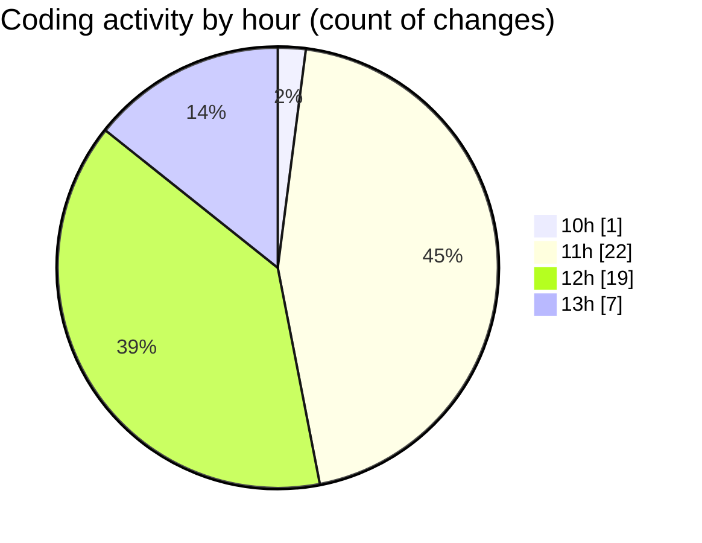

# nxtqube_webapp - Activity Summary 

## Overall Statistics

| Stat                   | Value                                                             |
| ---------------------- | ----------------------------------------------------------------- |
| **Lines Added** (➕)   | 1705                                          |
| **Lines Removed** (➖) | 340                                        |
| **Net Change** (↕)    | 1365                |
| **Active Time** (⌚)   | 67 minutes |

## Modified Files
- **OrbitMissionControl.tsx** (+154, -22)
- **create3DMission.tsx** (+338, -273)
- **MissionInfo.tsx** (+1001, -17)
- **save.json** (+106, -20)
- **save.ts** (+106, -8)

## Visualizations

### By File Type (Lines Changed)

### By Hour (Estimated Activity Count)

> **Last Updated:** 30/03/2026, 13:10:44