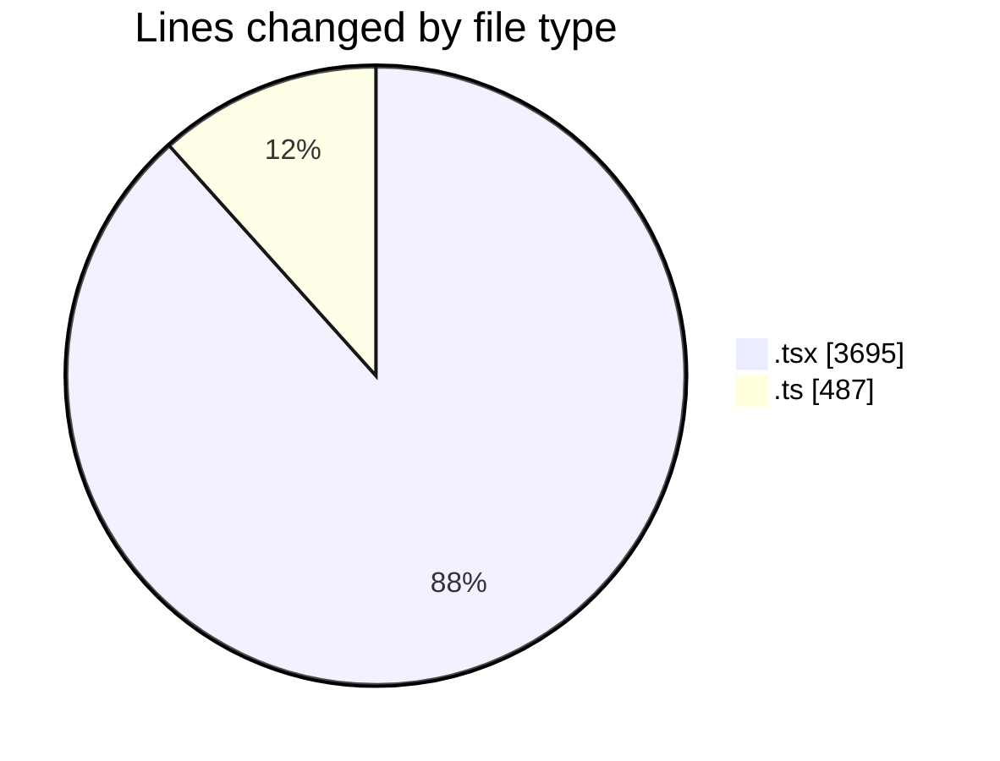
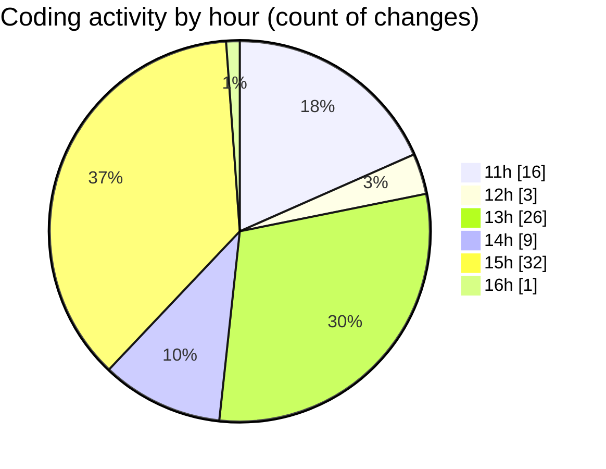

# nxtqube_webapp - Activity Summary 

## Overall Statistics

| Stat                   | Value                                                             |
| ---------------------- | ----------------------------------------------------------------- |
| **Lines Added** (➕)   | 3281                                          |
| **Lines Removed** (➖) | 901                                        |
| **Net Change** (↕)    | 2380                |
| **Active Time** (⌚)   | 123 minutes |

## Modified Files
- **StackMission3D.tsx** (+1568, -883)
- **OrbitMission3D.tsx** (+197, -7)
- **create3DMission.tsx** (+1029, -11)
- **mission.validator.ts** (+487, -0)

## Visualizations

### By File Type (Lines Changed)

### By Hour (Estimated Activity Count)

> **Last Updated:** 31/03/2026, 16:02:06