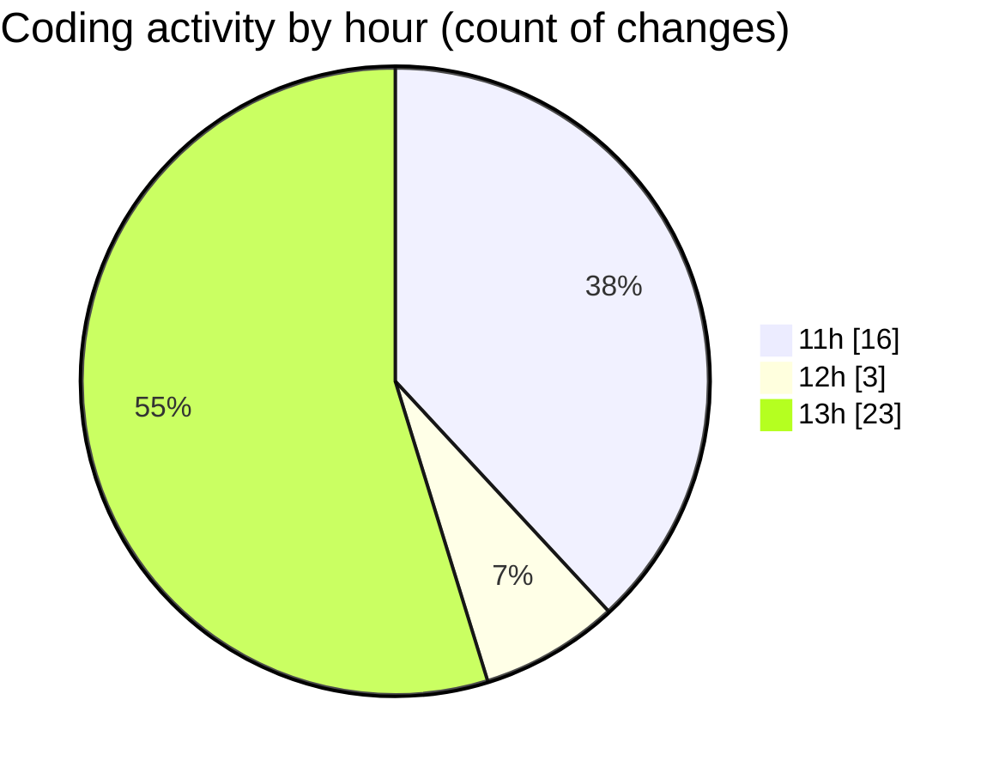

# nxtqube_webapp - Activity Summary 

## Overall Statistics

| Stat                   | Value                                                             |
| ---------------------- | ----------------------------------------------------------------- |
| **Lines Added** (➕)   | 2507                                          |
| **Lines Removed** (➖) | 153                                        |
| **Net Change** (↕)    | 2354                |
| **Active Time** (⌚)   | 66 minutes |

## Modified Files
- **StackMission3D.tsx** (+819, -146)
- **OrbitMission3D.tsx** (+197, -7)
- **create3DMission.tsx** (+1004, -0)
- **mission.validator.ts** (+487, -0)

## Visualizations

### By File Type (Lines Changed)

### By Hour (Estimated Activity Count)

> **Last Updated:** 31/03/2026, 13:51:28