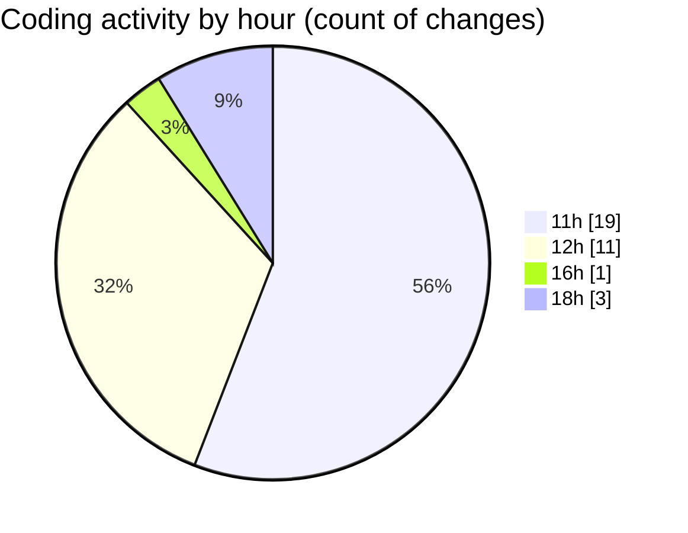

# nxtqube_webapp - Activity Summary 

## Overall Statistics

| Stat                   | Value                                                             |
| ---------------------- | ----------------------------------------------------------------- |
| **Lines Added** (➕)   | 6315                                          |
| **Lines Removed** (➖) | 80                                        |
| **Net Change** (↕)    | 6235                |
| **Active Time** (⌚)   | 44 minutes |

## Modified Files
- **use.cesium.map.tsx** (+3365, -58)
- **Existing.tsx** (+470, -0)
- **ExistingMission.tsx** (+541, -0)
- **create3DMission.tsx** (+1219, -3)
- **StackMission3D.tsx** (+720, -19)

## Visualizations

### By File Type (Lines Changed)

### By Hour (Estimated Activity Count)

> **Last Updated:** 01/04/2026, 18:33:52