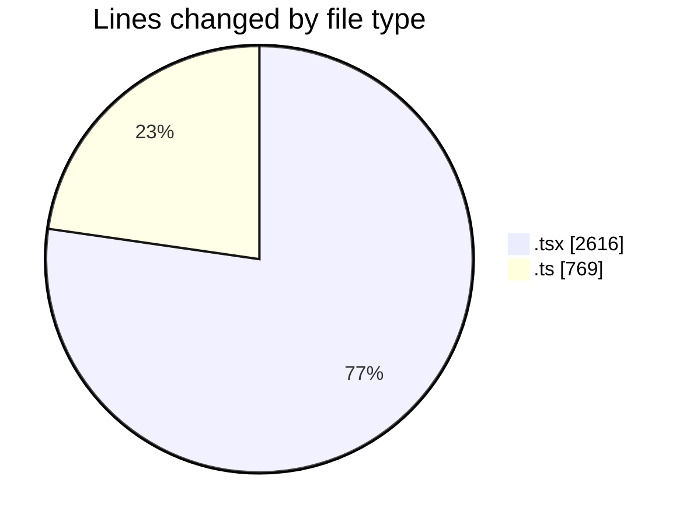
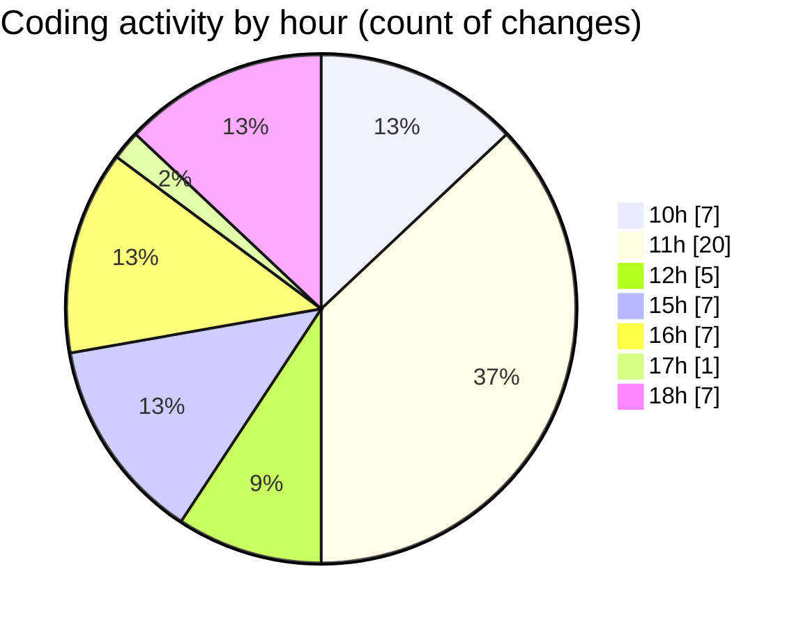

# nxtqube_webapp - Activity Summary 

## Overall Statistics

| Stat                   | Value                                                             |
| ---------------------- | ----------------------------------------------------------------- |
| **Lines Added** (➕)   | 2740                                          |
| **Lines Removed** (➖) | 645                                        |
| **Net Change** (↕)    | 2095                |
| **Active Time** (⌚)   | 55 minutes |

## Modified Files
- **create3DMission.tsx** (+1805, -642)
- **mission.model.ts** (+522, -0)
- **OrbitMission3D.tsx** (+169, -0)
- **draw.stack.boundry.ts** (+244, -3)

## Visualizations

### By File Type (Lines Changed)

### By Hour (Estimated Activity Count)

> **Last Updated:** 03/04/2026, 18:37:17