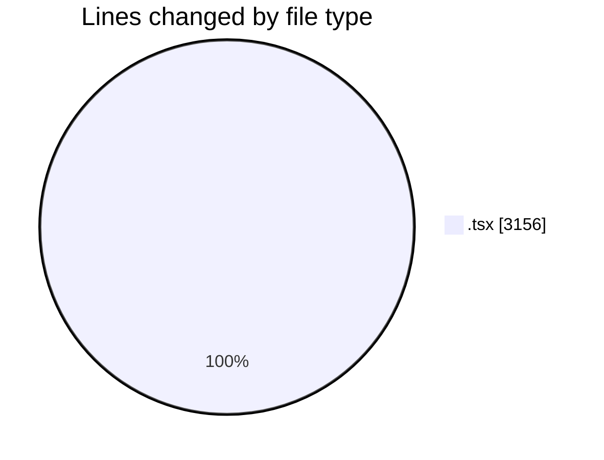
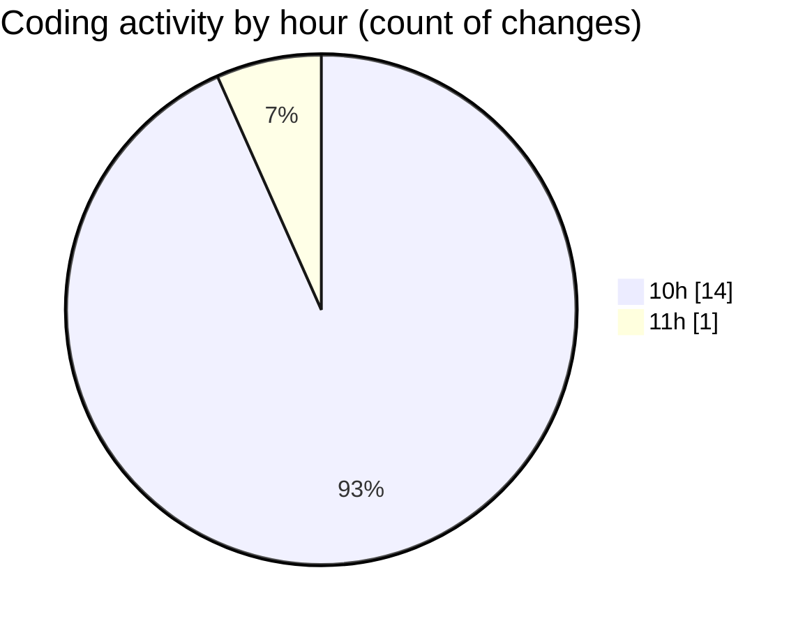

# nxtqube_webapp - Activity Summary 

## Overall Statistics

| Stat                   | Value                                                             |
| ---------------------- | ----------------------------------------------------------------- |
| **Lines Added** (➕)   | 3124                                          |
| **Lines Removed** (➖) | 32                                        |
| **Net Change** (↕)    | 3092                |
| **Active Time** (⌚)   | 24 minutes |

## Modified Files
- **StackMissionControl.tsx** (+1144, -3)
- **OrbitMission3D.tsx** (+178, -19)
- **OrbitMissionControl.tsx** (+632, -0)
- **create3DMission.tsx** (+1170, -10)

## Visualizations

### By File Type (Lines Changed)

### By Hour (Estimated Activity Count)

> **Last Updated:** 05/04/2026, 11:05:42