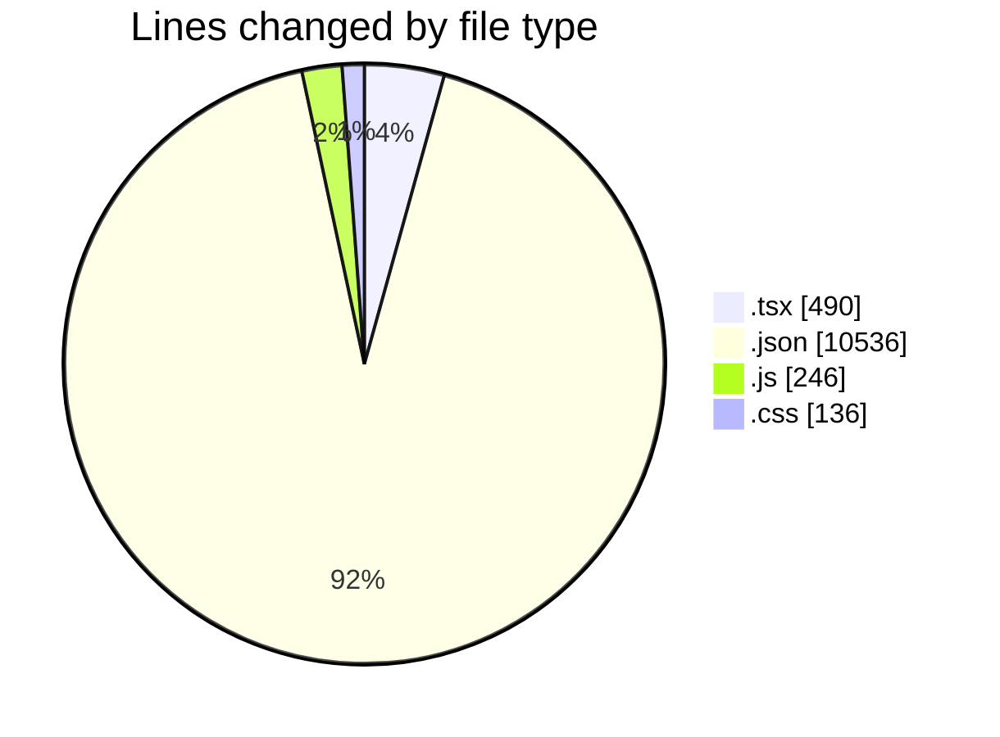
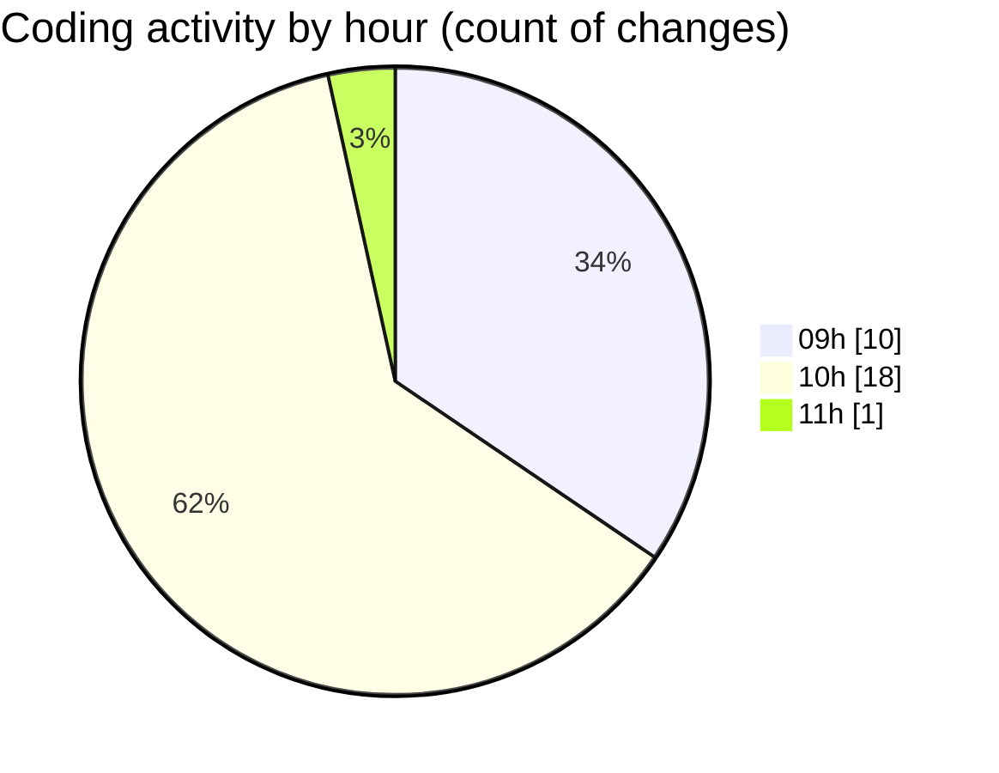

# Airfeed-Analytics-Dashboard - Activity Summary 

## Overall Statistics

| Stat                   | Value                                                             |
| ---------------------- | ----------------------------------------------------------------- |
| **Lines Added** (➕)   | 11122                                          |
| **Lines Removed** (➖) | 286                                        |
| **Net Change** (↕)    | 10836                |
| **Active Time** (⌚)   | 36 minutes |

## Modified Files
- **Dashboard.tsx** (+221, -205)
- **mapContainer.tsx** (+37, -0)
- **rightSideBar.tsx** (+11, -0)
- **bottomStats.tsx** (+16, -0)
- **tsconfig.json** (+24, -8)
- **package-lock.json** (+10504, -0)
- **tailwind.config.js** (+175, -71)
- **index.css** (+134, -2)

## Visualizations

### By File Type (Lines Changed)

### By Hour (Estimated Activity Count)

> **Last Updated:** 06/04/2026, 11:26:08