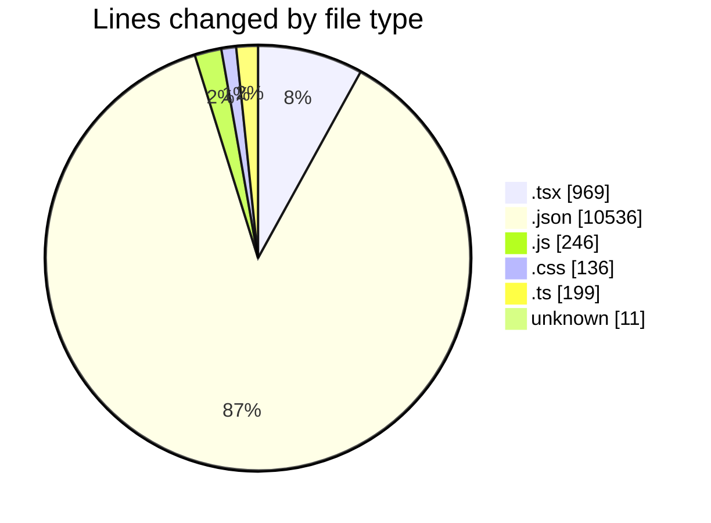
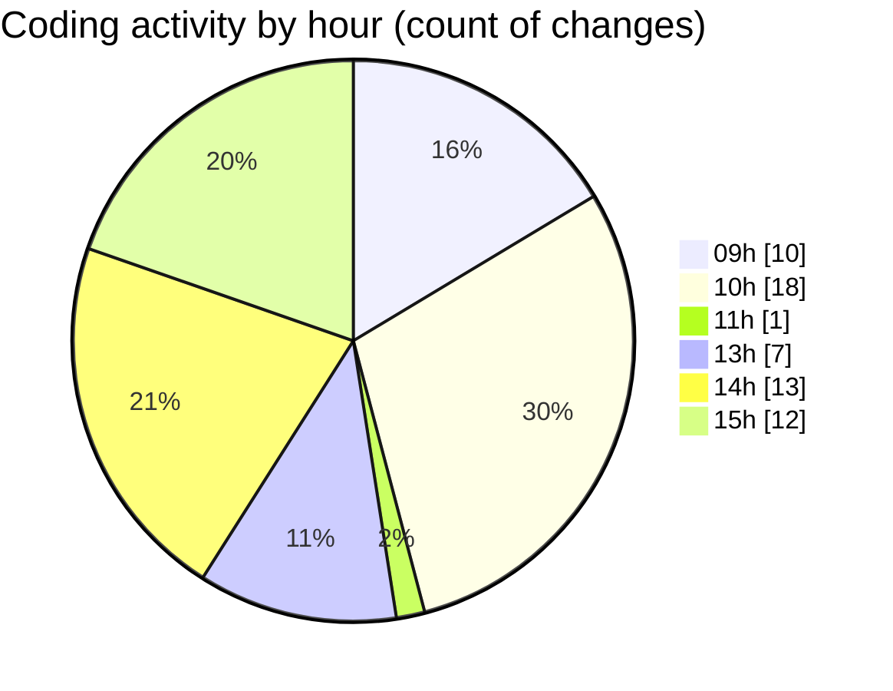

# Airfeed-Analytics-Dashboard - Activity Summary 

## Overall Statistics

| Stat                   | Value                                                             |
| ---------------------- | ----------------------------------------------------------------- |
| **Lines Added** (➕)   | 11718                                          |
| **Lines Removed** (➖) | 379                                        |
| **Net Change** (↕)    | 11339                |
| **Active Time** (⌚)   | 73 minutes |

## Modified Files
- **Dashboard.tsx** (+221, -205)
- **mapContainer.tsx** (+94, -14)
- **rightSideBar.tsx** (+153, -21)
- **bottomStats.tsx** (+135, -0)
- **tsconfig.json** (+24, -8)
- **package-lock.json** (+10504, -0)
- **tailwind.config.js** (+175, -71)
- **index.css** (+134, -2)
- **viewer.ts** (+142, -40)
- **vite-env.d.ts** (+13, -4)
- **cesium.provider.tsx** (+95, -9)
- **main.tsx** (+17, -5)
- **.env** (+9, -0)
- **.env** (+2, -0)

## Visualizations

### By File Type (Lines Changed)

### By Hour (Estimated Activity Count)

> **Last Updated:** 06/04/2026, 15:44:14