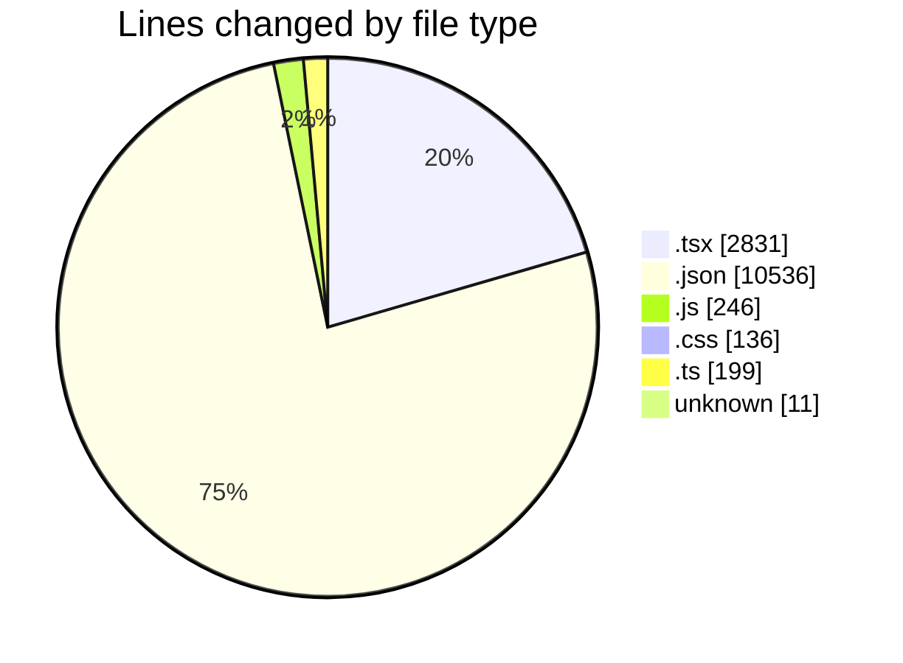
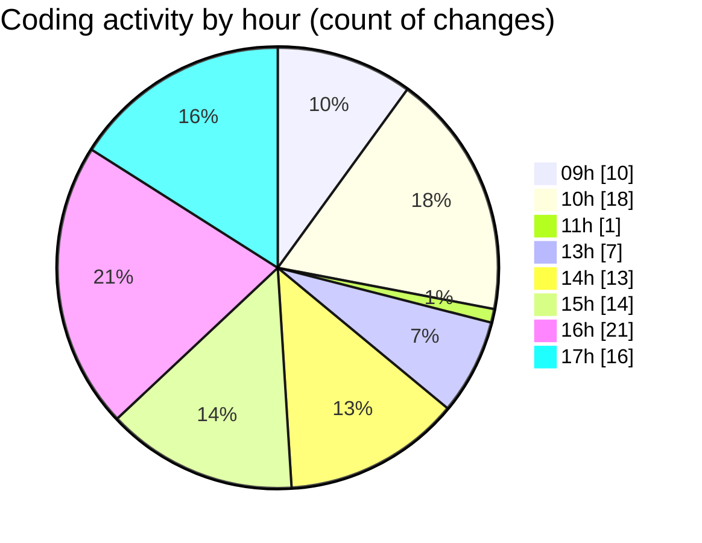

# Airfeed-Analytics-Dashboard - Activity Summary 

## Overall Statistics

| Stat                   | Value                                                             |
| ---------------------- | ----------------------------------------------------------------- |
| **Lines Added** (➕)   | 13049                                          |
| **Lines Removed** (➖) | 910                                        |
| **Net Change** (↕)    | 12139                |
| **Active Time** (⌚)   | 133 minutes |

## Modified Files
- **Dashboard.tsx** (+223, -205)
- **mapContainer.tsx** (+94, -14)
- **rightSideBar.tsx** (+153, -21)
- **bottomStats.tsx** (+284, -136)
- **tsconfig.json** (+24, -8)
- **package-lock.json** (+10504, -0)
- **tailwind.config.js** (+175, -71)
- **index.css** (+134, -2)
- **viewer.ts** (+142, -40)
- **vite-env.d.ts** (+13, -4)
- **cesium.provider.tsx** (+95, -9)
- **main.tsx** (+17, -5)
- **.env** (+9, -0)
- **.env** (+2, -0)
- **DashboardSections.tsx** (+98, -50)
- **DetectionLog.tsx** (+122, -0)
- **DroneFleet.tsx** (+146, -0)
- **Schedule.tsx** (+322, -72)
- **DockOperations.tsx** (+85, -0)
- **Tags.tsx** (+96, -32)
- **DetectionTypes.tsx** (+311, -241)

## Visualizations

### By File Type (Lines Changed)

### By Hour (Estimated Activity Count)

> **Last Updated:** 06/04/2026, 17:53:22