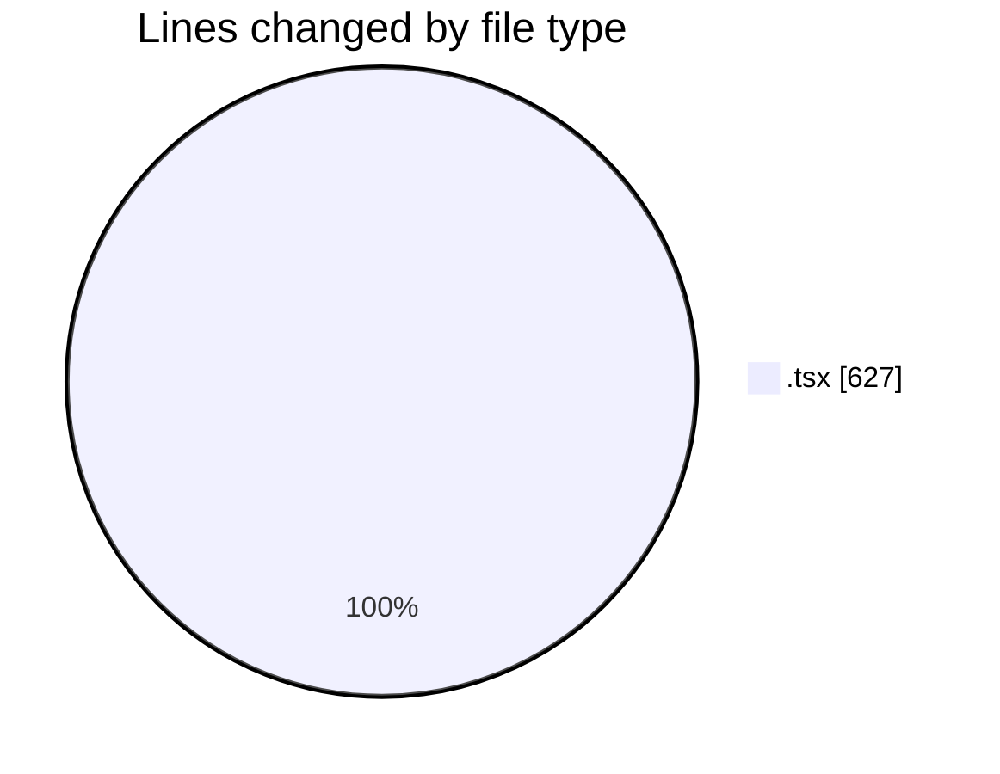
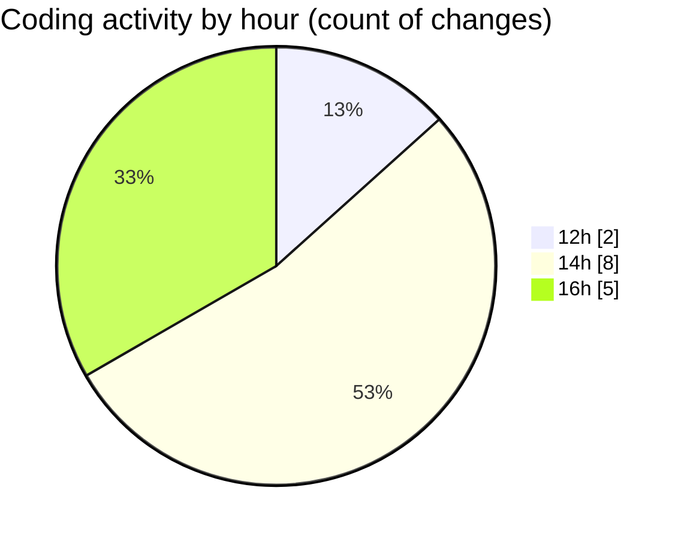

# Airfeed-Analytics-Dashboard - Activity Summary 

## Overall Statistics

| Stat                   | Value                                                             |
| ---------------------- | ----------------------------------------------------------------- |
| **Lines Added** (➕)   | 541                                          |
| **Lines Removed** (➖) | 86                                        |
| **Net Change** (↕)    | 455                |
| **Active Time** (⌚)   | 16 minutes |

## Modified Files
- **Dashboard.tsx** (+19, -1)
- **ReportDashboard.tsx** (+65, -0)
- **CreateReportPanel.tsx** (+76, -0)
- **ReportsFilters.tsx** (+76, -0)
- **FilterBtn.tsx** (+7, -0)
- **DashboardSections.tsx** (+48, -2)
- **Schedule.tsx** (+250, -83)

## Visualizations

### By File Type (Lines Changed)

### By Hour (Estimated Activity Count)

> **Last Updated:** 07/04/2026, 16:23:42