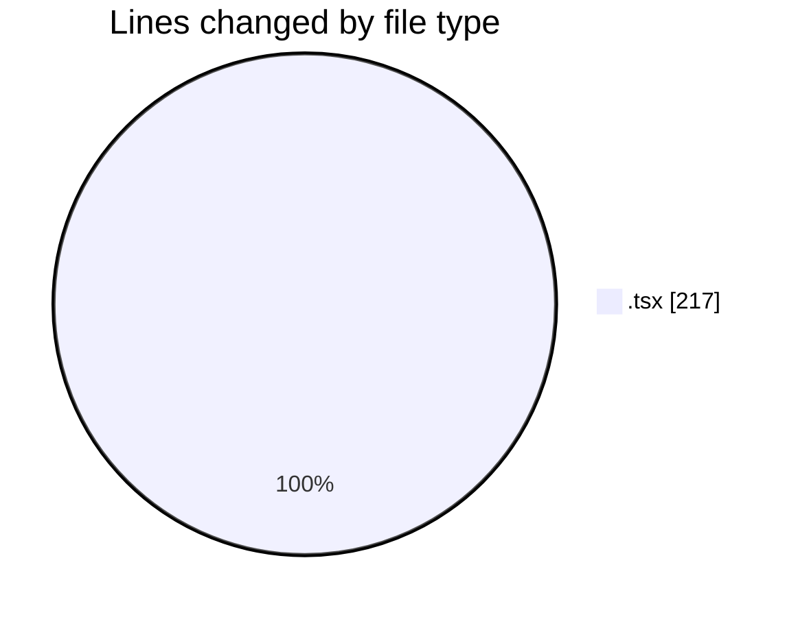
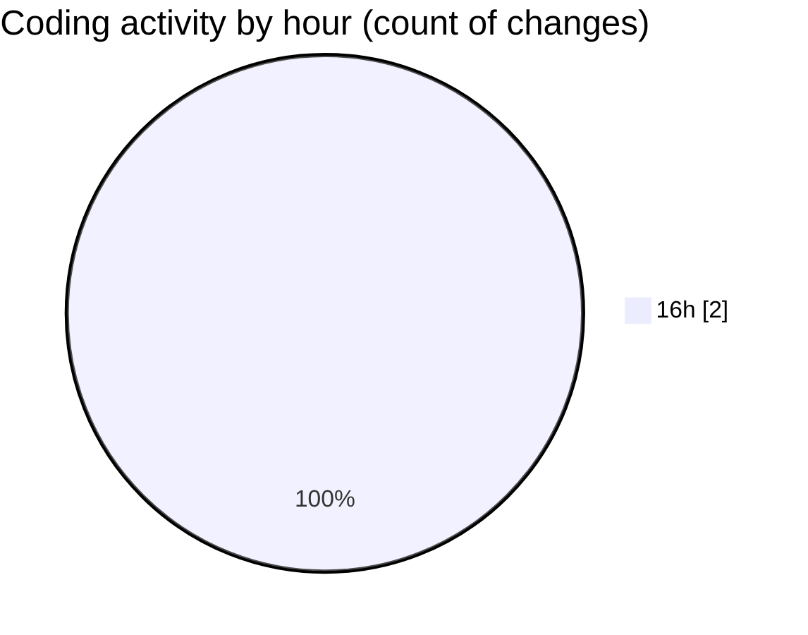

# Airfeed-Analytics-Dashboard - Activity Summary 

## Overall Statistics

| Stat                   | Value                                                             |
| ---------------------- | ----------------------------------------------------------------- |
| **Lines Added** (➕)   | 169                                          |
| **Lines Removed** (➖) | 48                                        |
| **Net Change** (↕)    | 121                |
| **Active Time** (⌚)   | 1 minute |

## Modified Files
- **TimePicker.tsx** (+169, -48)

## Visualizations

### By File Type (Lines Changed)

### By Hour (Estimated Activity Count)

> **Last Updated:** 08/04/2026, 16:34:51