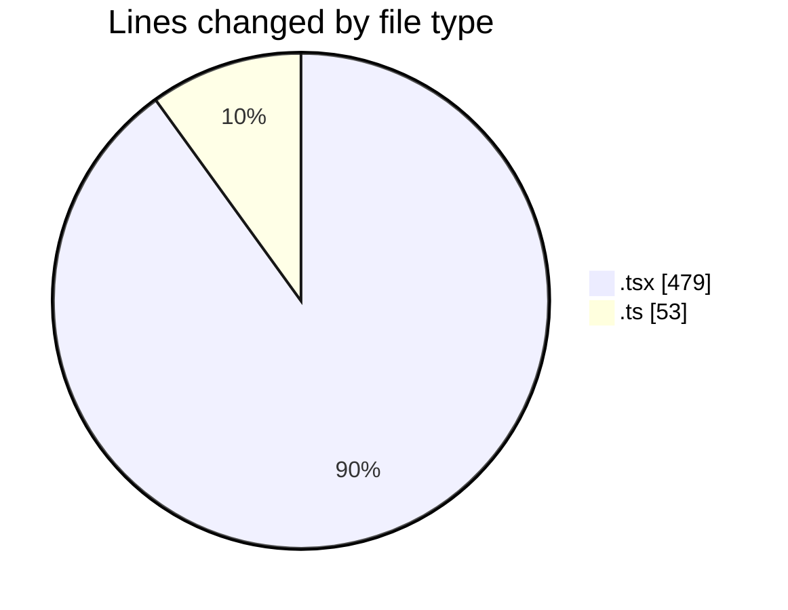
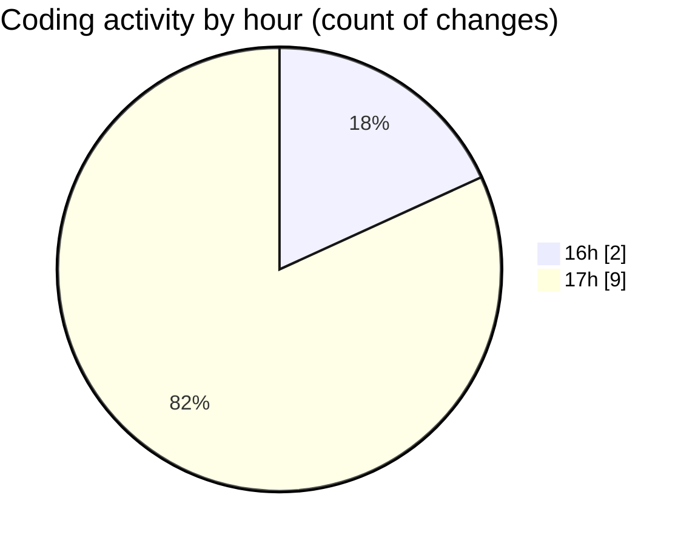

# Airfeed-Analytics-Dashboard - Activity Summary 

## Overall Statistics

| Stat                   | Value                                                             |
| ---------------------- | ----------------------------------------------------------------- |
| **Lines Added** (➕)   | 429                                          |
| **Lines Removed** (➖) | 103                                        |
| **Net Change** (↕)    | 326                |
| **Active Time** (⌚)   | 11 minutes |

## Modified Files
- **TimePicker.tsx** (+169, -48)
- **badge.tsx** (+54, -9)
- **button.tsx** (+74, -9)
- **router.tsx** (+79, -37)
- **vite.config.ts** (+53, -0)

## Visualizations

### By File Type (Lines Changed)

### By Hour (Estimated Activity Count)

> **Last Updated:** 08/04/2026, 17:38:09