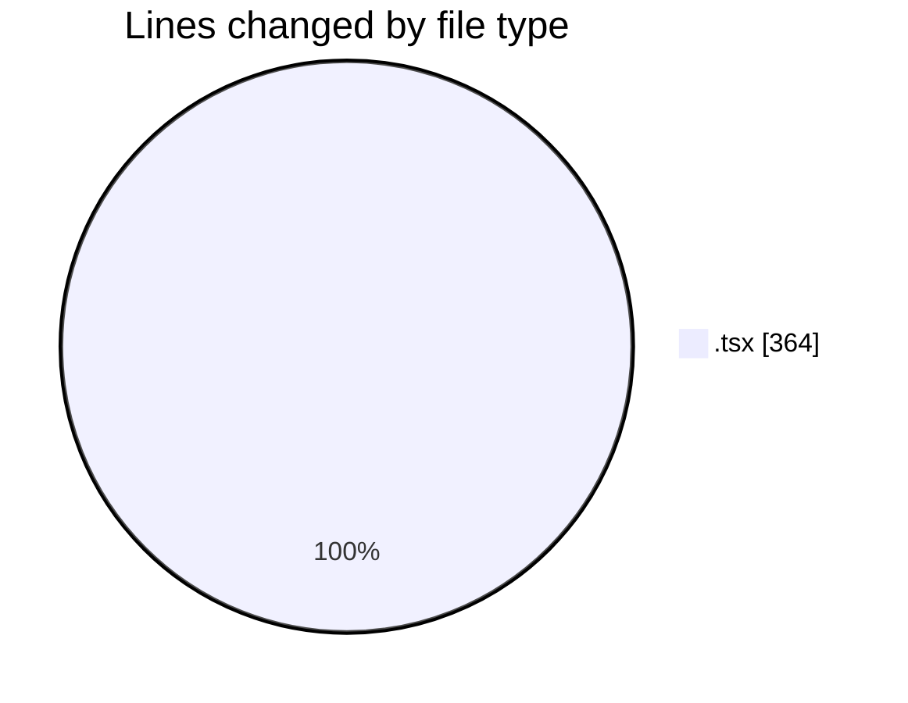
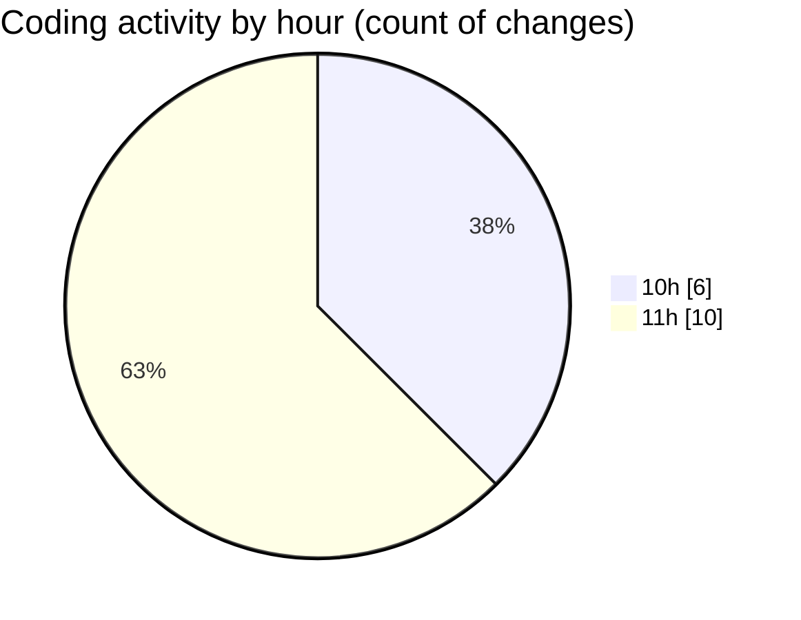

# Airfeed-Analytics-Dashboard - Activity Summary 

## Overall Statistics

| Stat                   | Value                                                             |
| ---------------------- | ----------------------------------------------------------------- |
| **Lines Added** (➕)   | 272                                          |
| **Lines Removed** (➖) | 92                                        |
| **Net Change** (↕)    | 180                |
| **Active Time** (⌚)   | 13 minutes |

## Modified Files
- **Dashboard.tsx** (+18, -0)
- **ReportDashboard.tsx** (+65, -32)
- **ReportsHeader.tsx** (+12, -3)
- **ReportsFilters.tsx** (+76, -44)
- **ReportsTable.tsx** (+25, -1)
- **CreateReportPanel.tsx** (+76, -12)

## Visualizations

### By File Type (Lines Changed)

### By Hour (Estimated Activity Count)

> **Last Updated:** 09/04/2026, 11:33:03