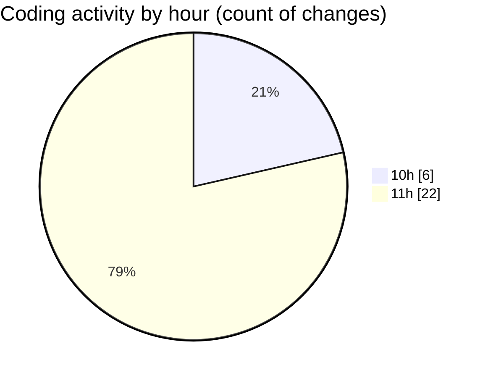

# Airfeed-Analytics-Dashboard - Activity Summary 

## Overall Statistics

| Stat                   | Value                                                             |
| ---------------------- | ----------------------------------------------------------------- |
| **Lines Added** (➕)   | 777                                          |
| **Lines Removed** (➖) | 259                                        |
| **Net Change** (↕)    | 518                |
| **Active Time** (⌚)   | 31 minutes |

## Modified Files
- **Dashboard.tsx** (+18, -0)
- **ReportDashboard.tsx** (+172, -32)
- **ReportsHeader.tsx** (+12, -3)
- **ReportsFilters.tsx** (+76, -44)
- **ReportsTable.tsx** (+52, -2)
- **CreateReportPanel.tsx** (+147, -12)
- **ReportRow.tsx** (+300, -166)

## Visualizations

### By File Type (Lines Changed)

### By Hour (Estimated Activity Count)

> **Last Updated:** 09/04/2026, 11:43:03