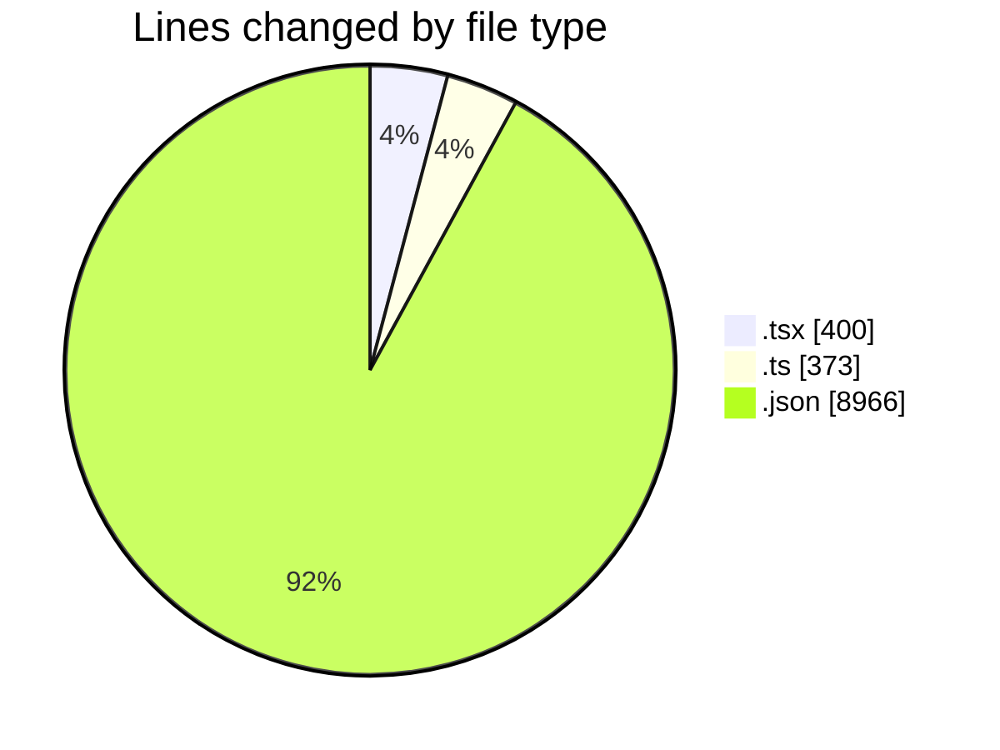
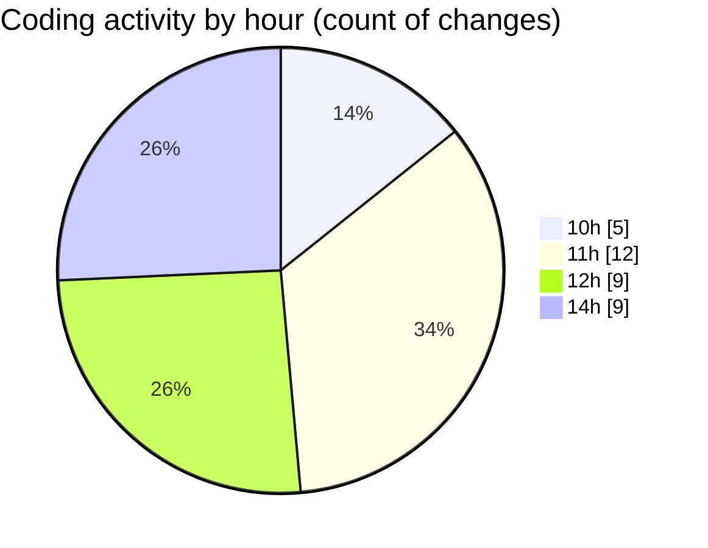

# Airfeed-Analytics-Dashboard - Activity Summary 

## Overall Statistics

| Stat                   | Value                                                             |
| ---------------------- | ----------------------------------------------------------------- |
| **Lines Added** (➕)   | 7963                                          |
| **Lines Removed** (➖) | 1776                                        |
| **Net Change** (↕)    | 6187                |
| **Active Time** (⌚)   | 42 minutes |

## Modified Files
- **createMission.tsx** (+92, -2)
- **MissionList.tsx** (+249, -42)
- **main.ts** (+92, -0)
- **package-lock.json** (+7254, -1712)
- **index.ts** (+15, -5)
- **Mission.tsx** (+15, -0)
- **mission.ts** (+30, -0)
- **api.ts** (+216, -15)

## Visualizations

### By File Type (Lines Changed)

### By Hour (Estimated Activity Count)

> **Last Updated:** 12/04/2026, 14:14:51