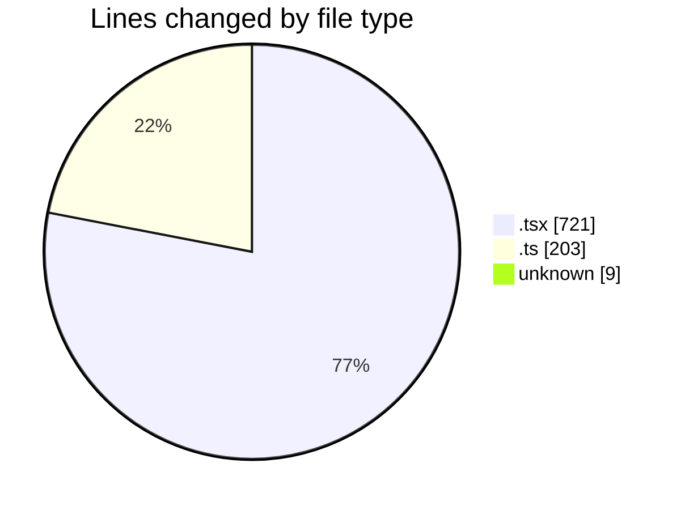
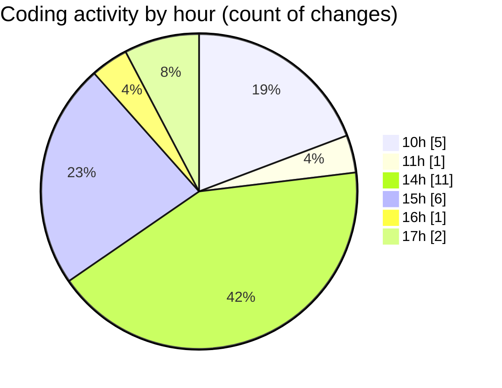

# Airfeed-Analytics-Dashboard - Activity Summary 

## Overall Statistics

| Stat                   | Value                                                             |
| ---------------------- | ----------------------------------------------------------------- |
| **Lines Added** (➕)   | 876                                          |
| **Lines Removed** (➖) | 57                                        |
| **Net Change** (↕)    | 819                |
| **Active Time** (⌚)   | 25 minutes |

## Modified Files
- **Dashboard.tsx** (+18, -0)
- **bottomStats.tsx** (+165, -17)
- **log.ts** (+17, -1)
- **MissionList.tsx** (+399, -38)
- **logs.controller.ts** (+128, -1)
- **.env** (+9, -0)
- **ReportRow.tsx** (+84, -0)
- **report.ts** (+56, -0)

## Visualizations

### By File Type (Lines Changed)

### By Hour (Estimated Activity Count)

> **Last Updated:** 13/04/2026, 17:58:24