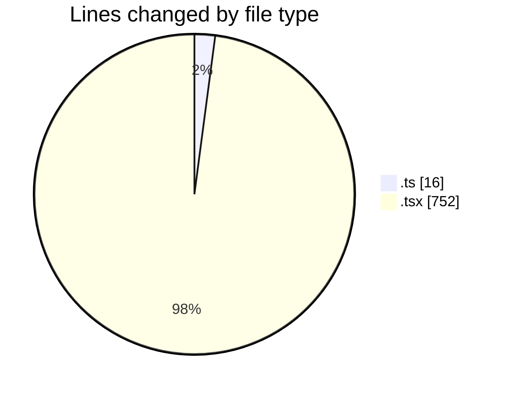
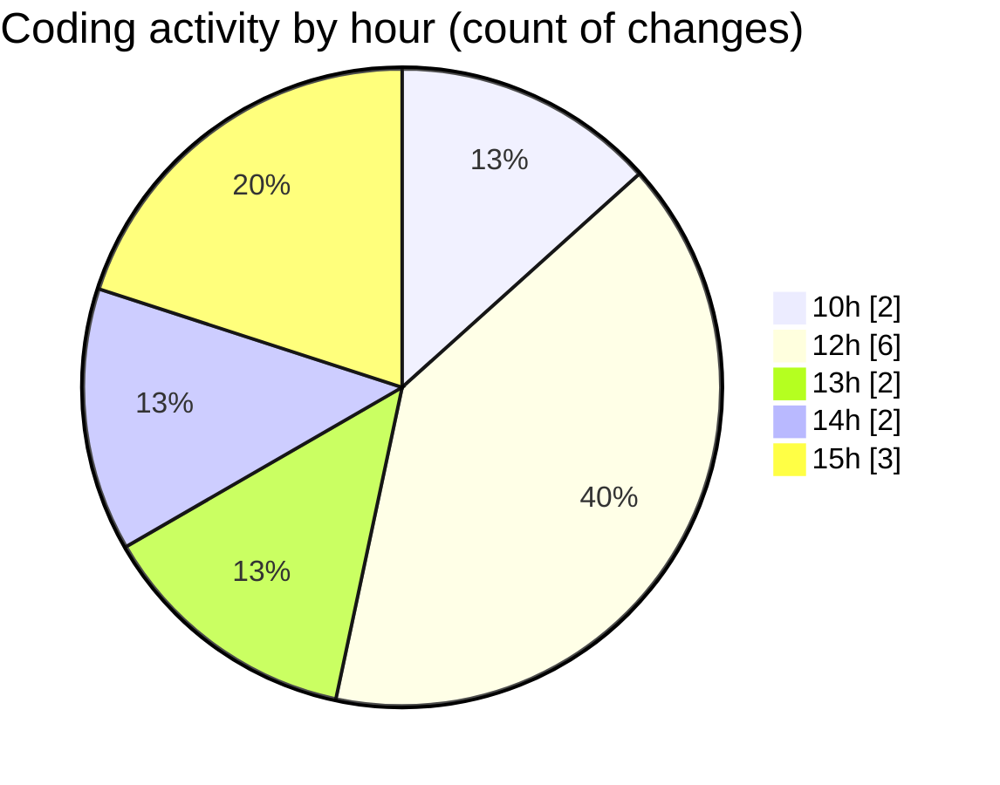

# Airfeed-Analytics-Dashboard - Activity Summary 

## Overall Statistics

| Stat                   | Value                                                             |
| ---------------------- | ----------------------------------------------------------------- |
| **Lines Added** (➕)   | 765                                          |
| **Lines Removed** (➖) | 3                                        |
| **Net Change** (↕)    | 762                |
| **Active Time** (⌚)   | 18 minutes |

## Modified Files
- **index.ts** (+14, -0)
- **report.ts** (+2, -0)
- **ReportsFilters.tsx** (+91, -0)
- **ReportsTable.tsx** (+97, -0)
- **FilterBtn.tsx** (+21, -0)
- **ReportDashboard.tsx** (+183, -3)
- **CreateReportPanel.tsx** (+131, -0)
- **date.range.picker.tsx** (+226, -0)

## Visualizations

### By File Type (Lines Changed)

### By Hour (Estimated Activity Count)

> **Last Updated:** 15/04/2026, 15:06:07