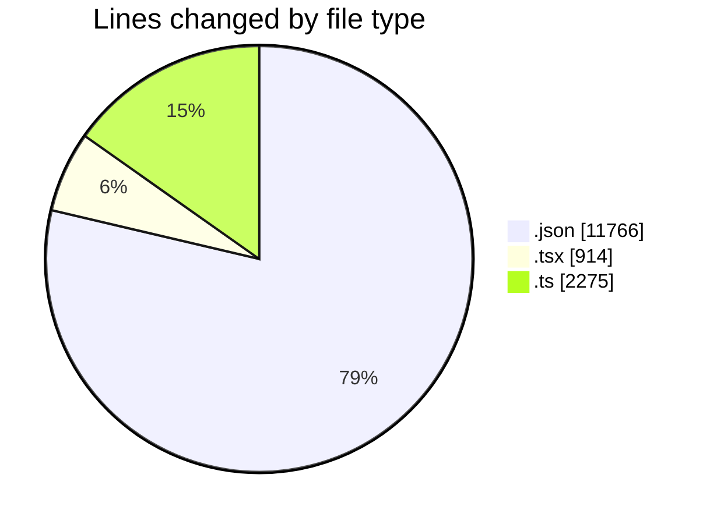
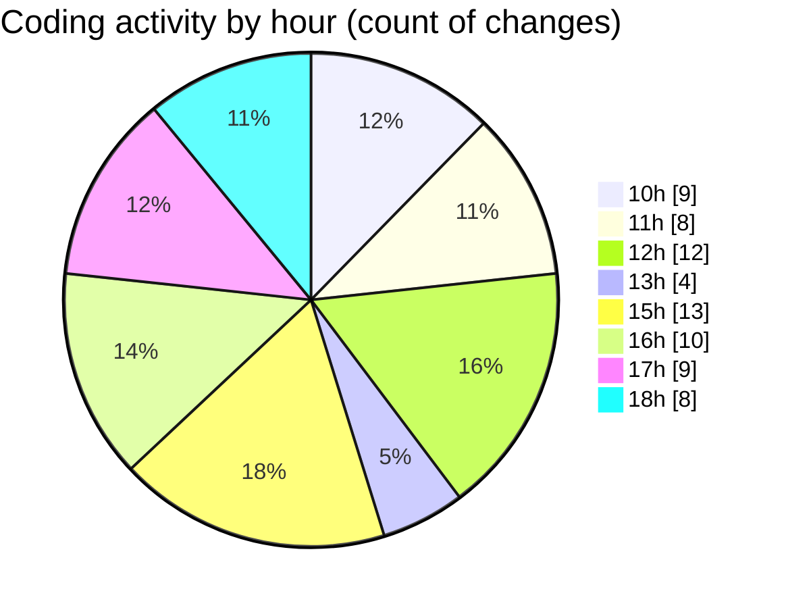

# Airfeed-Analytics-Dashboard - Activity Summary 

## Overall Statistics

| Stat                   | Value                                                             |
| ---------------------- | ----------------------------------------------------------------- |
| **Lines Added** (➕)   | 14624                                          |
| **Lines Removed** (➖) | 331                                        |
| **Net Change** (↕)    | 14293                |
| **Active Time** (⌚)   | 91 minutes |

## Modified Files
- **package-lock.json** (+11730, -36)
- **CreateReportPanel.tsx** (+361, -0)
- **report.route.ts** (+20, -3)
- **report.ts** (+177, -32)
- **ReportsTable.tsx** (+232, -18)
- **report.controller.ts** (+1034, -212)
- **ReportDashboard.tsx** (+193, -1)
- **reports.model.ts** (+74, -0)
- **main.ts** (+103, -0)
- **detection.controller.ts** (+336, -0)
- **ReportRow.tsx** (+108, -1)
- **api.ts** (+202, -19)
- **tag.ts** (+54, -9)

## Visualizations

### By File Type (Lines Changed)

### By Hour (Estimated Activity Count)

> **Last Updated:** 16/04/2026, 18:14:59