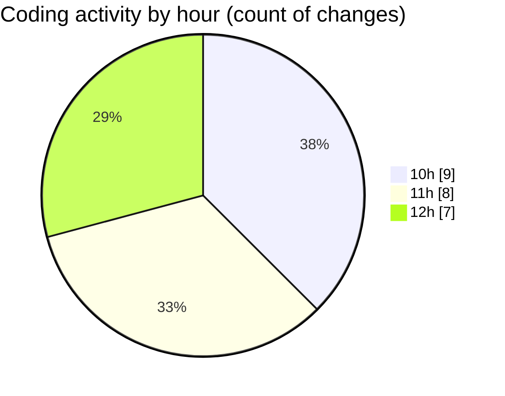

# Airfeed-Analytics-Dashboard - Activity Summary 

## Overall Statistics

| Stat                   | Value                                                             |
| ---------------------- | ----------------------------------------------------------------- |
| **Lines Added** (➕)   | 12991                                          |
| **Lines Removed** (➖) | 108                                        |
| **Net Change** (↕)    | 12883                |
| **Active Time** (⌚)   | 28 minutes |

## Modified Files
- **package-lock.json** (+11730, -36)
- **CreateReportPanel.tsx** (+136, -0)
- **report.route.ts** (+20, -3)
- **report.ts** (+86, -30)
- **ReportsTable.tsx** (+96, -1)
- **report.controller.ts** (+923, -38)

## Visualizations

### By File Type (Lines Changed)

### By Hour (Estimated Activity Count)

> **Last Updated:** 16/04/2026, 12:40:36