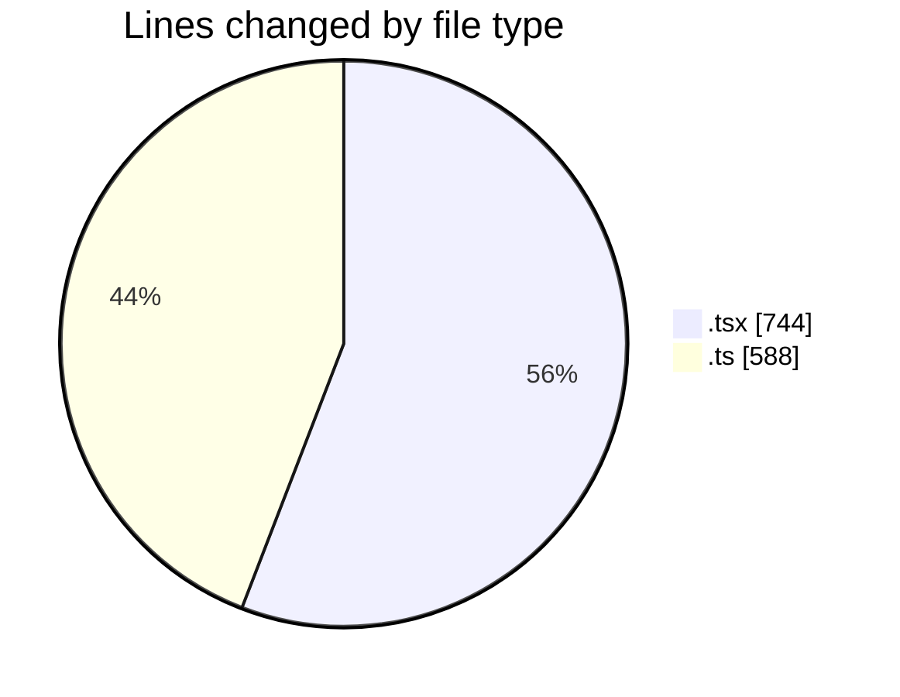
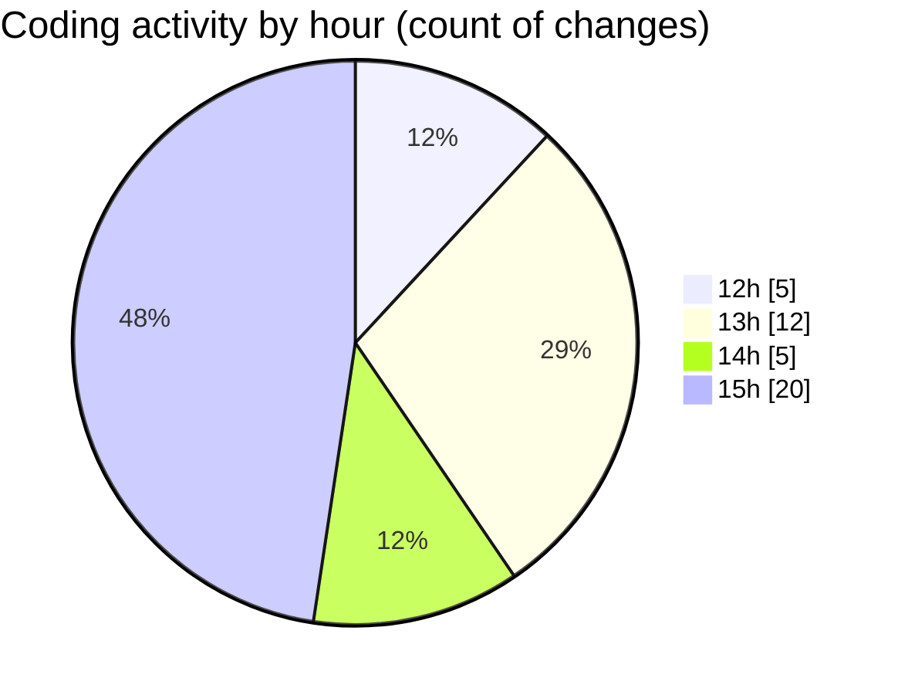

# Airfeed-Analytics-Dashboard - Activity Summary 

## Overall Statistics

| Stat                   | Value                                                             |
| ---------------------- | ----------------------------------------------------------------- |
| **Lines Added** (➕)   | 1144                                          |
| **Lines Removed** (➖) | 188                                        |
| **Net Change** (↕)    | 956                |
| **Active Time** (⌚)   | 62 minutes |

## Modified Files
- **CreateReportPanel.tsx** (+436, -17)
- **Tags.tsx** (+56, -0)
- **tag.ts** (+87, -18)
- **report.ts** (+181, -80)
- **ReportsTable.tsx** (+128, -20)
- **model.ts** (+169, -53)
- **mapContainer.tsx** (+87, -0)

## Visualizations

### By File Type (Lines Changed)

### By Hour (Estimated Activity Count)

> **Last Updated:** 17/04/2026, 15:32:34