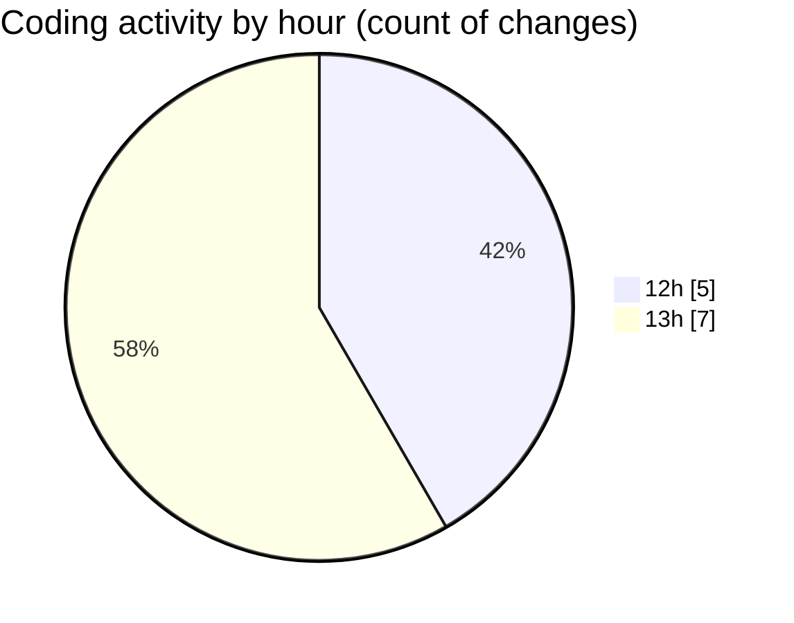

# Airfeed-Analytics-Dashboard - Activity Summary 

## Overall Statistics

| Stat                   | Value                                                             |
| ---------------------- | ----------------------------------------------------------------- |
| **Lines Added** (➕)   | 426                                          |
| **Lines Removed** (➖) | 10                                        |
| **Net Change** (↕)    | 416                |
| **Active Time** (⌚)   | 25 minutes |

## Modified Files
- **CreateReportPanel.tsx** (+312, -10)
- **Tags.tsx** (+56, -0)
- **tag.ts** (+58, -0)

## Visualizations

### By File Type (Lines Changed)

### By Hour (Estimated Activity Count)

> **Last Updated:** 17/04/2026, 13:15:45