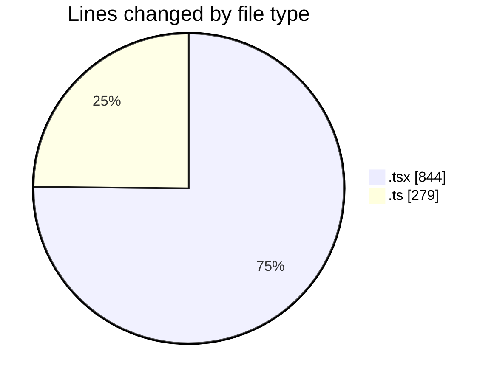
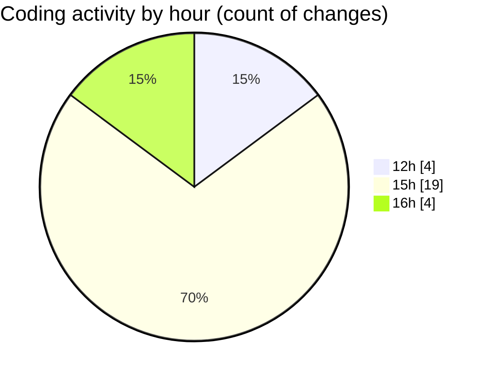

# Airfeed-Analytics-Dashboard - Activity Summary 

## Overall Statistics

| Stat                   | Value                                                             |
| ---------------------- | ----------------------------------------------------------------- |
| **Lines Added** (➕)   | 1085                                          |
| **Lines Removed** (➖) | 38                                        |
| **Net Change** (↕)    | 1047                |
| **Active Time** (⌚)   | 42 minutes |

## Modified Files
- **bottomStats.tsx** (+195, -1)
- **Schedule.tsx** (+470, -37)
- **mission.schedule.model.ts** (+72, -0)
- **mission.schedule.controller.ts** (+207, -0)
- **DroneFleet.tsx** (+94, -0)
- **DockOperations.tsx** (+47, -0)

## Visualizations

### By File Type (Lines Changed)

### By Hour (Estimated Activity Count)

> **Last Updated:** 19/04/2026, 16:31:13