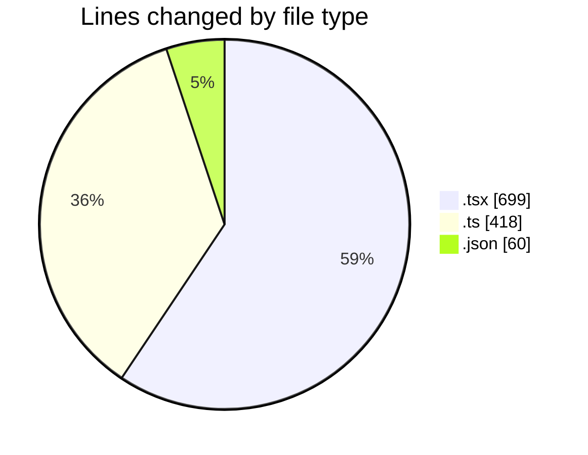
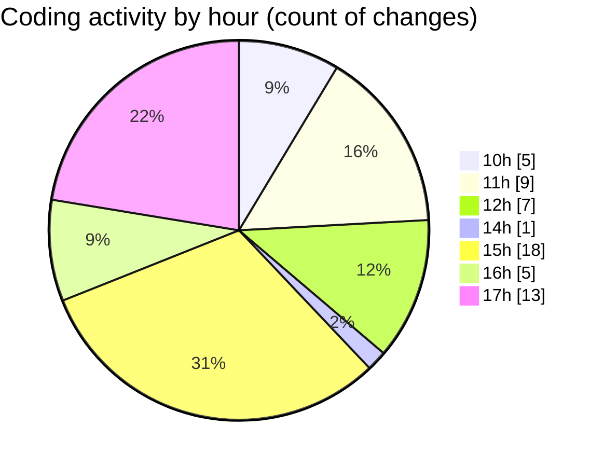

# Airfeed-Analytics-Dashboard - Activity Summary 

## Overall Statistics

| Stat                   | Value                                                             |
| ---------------------- | ----------------------------------------------------------------- |
| **Lines Added** (➕)   | 984                                          |
| **Lines Removed** (➖) | 193                                        |
| **Net Change** (↕)    | 791                |
| **Active Time** (⌚)   | 65 minutes |

## Modified Files
- **rightSideBar.tsx** (+378, -3)
- **tag.ts** (+64, -0)
- **mission.ts** (+62, -2)
- **DetectionLog.tsx** (+198, -120)
- **detection.ts** (+30, -1)
- **index.ts** (+18, -2)
- **detection.route.ts** (+23, -0)
- **package.json** (+60, -0)
- **report.ts** (+151, -65)

## Visualizations

### By File Type (Lines Changed)

### By Hour (Estimated Activity Count)

> **Last Updated:** 20/04/2026, 17:14:26