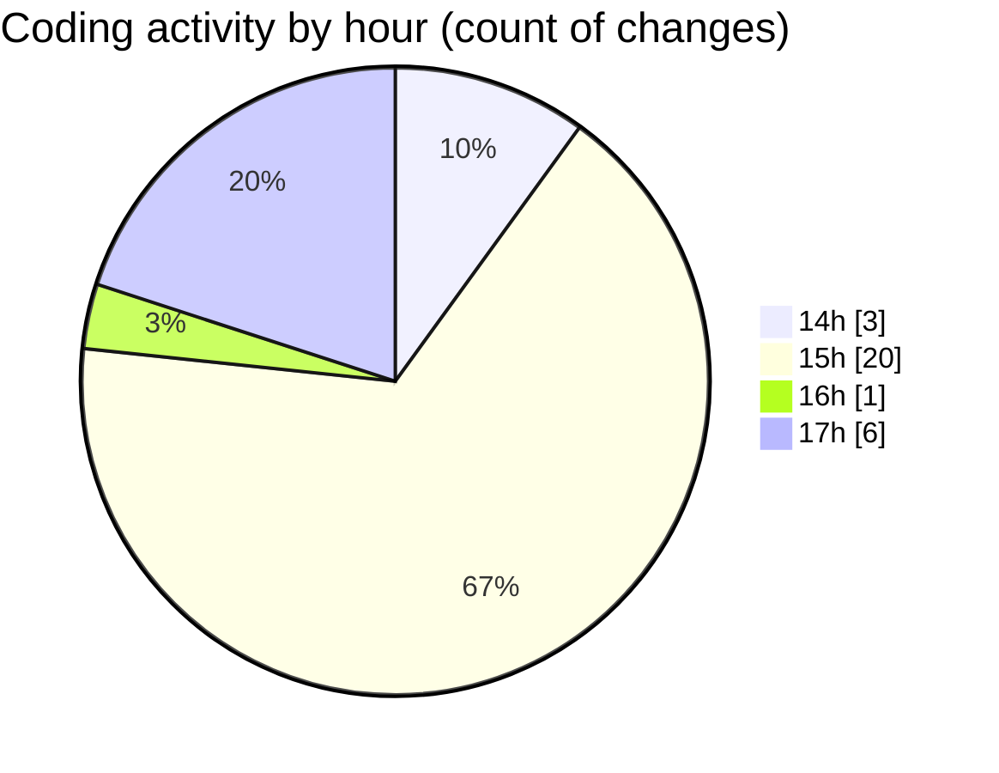

# nxtqube_webapp - Activity Summary 

## Overall Statistics

| Stat                   | Value                                                             |
| ---------------------- | ----------------------------------------------------------------- |
| **Lines Added** (➕)   | 4368                                          |
| **Lines Removed** (➖) | 43                                        |
| **Net Change** (↕)    | 4325                |
| **Active Time** (⌚)   | 34 minutes |

## Modified Files
- **createPathMission.tsx** (+888, -10)
- **geogence.create.tsx** (+1734, -0)
- **Existing.tsx** (+472, -2)
- **mission.validator.ts** (+529, -26)
- **mission.controller.ts** (+203, -4)
- **ExistingMission.tsx** (+542, -1)

## Visualizations

### By File Type (Lines Changed)

### By Hour (Estimated Activity Count)

> **Last Updated:** 23/04/2026, 17:11:55