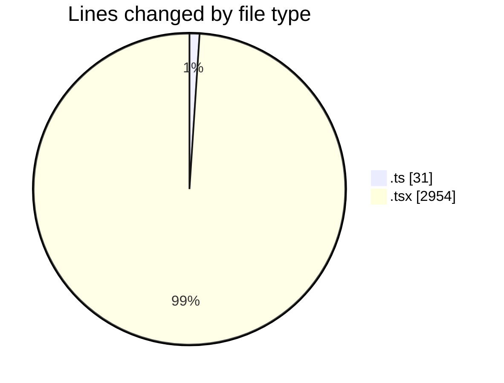
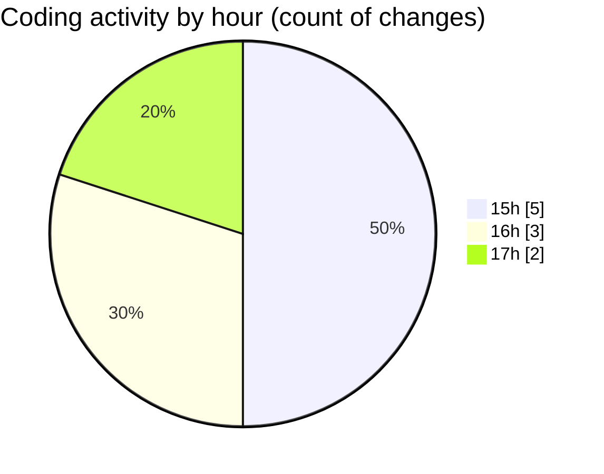

# nxtqube_webapp - Activity Summary 

## Overall Statistics

| Stat                   | Value                                                             |
| ---------------------- | ----------------------------------------------------------------- |
| **Lines Added** (➕)   | 2969                                          |
| **Lines Removed** (➖) | 16                                        |
| **Net Change** (↕)    | 2953                |
| **Active Time** (⌚)   | 4 minutes |

## Modified Files
- **mission.validator.ts** (+15, -16)
- **createPathMission.tsx** (+51, -0)
- **MissionControl.tsx** (+956, -0)
- **MissionInfo.tsx** (+1005, -0)
- **WaypointAction.tsx** (+942, -0)

## Visualizations

### By File Type (Lines Changed)

### By Hour (Estimated Activity Count)

> **Last Updated:** 24/04/2026, 17:35:39