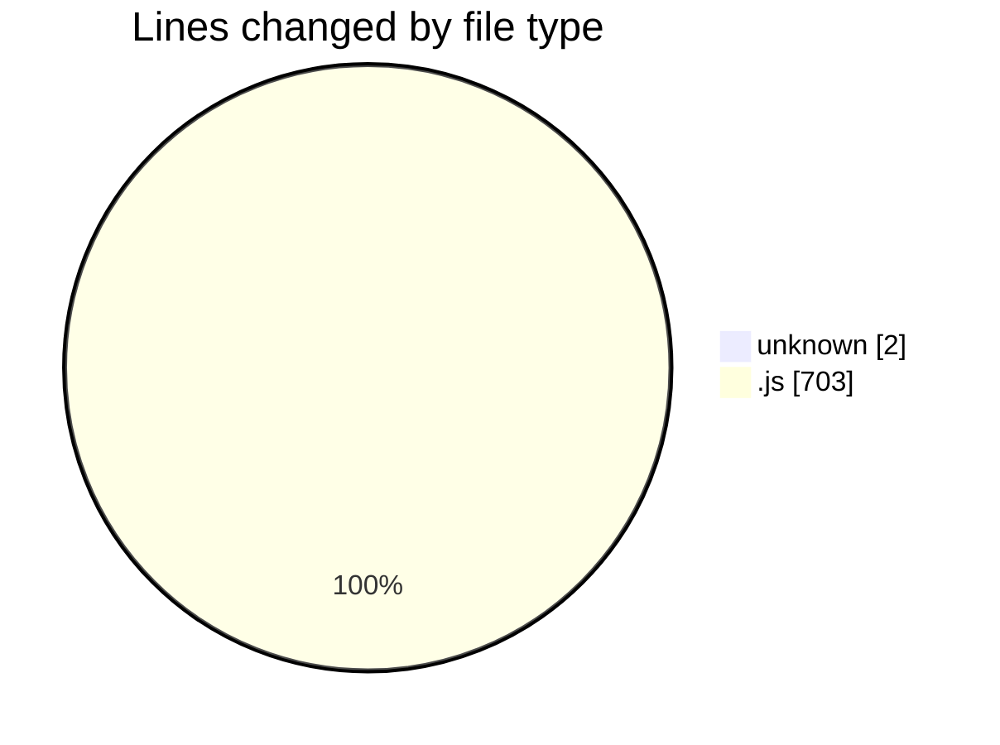
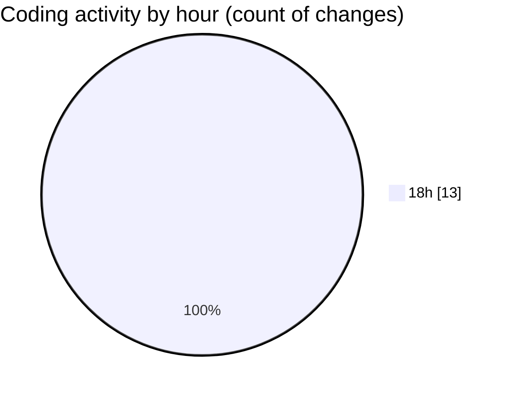

# calCApp - Activity Summary 

## Overall Statistics

| Stat                   | Value                                                             |
| ---------------------- | ----------------------------------------------------------------- |
| **Lines Added** (➕)   | 595                                          |
| **Lines Removed** (➖) | 110                                        |
| **Net Change** (↕)    | 485                |
| **Active Time** (⌚)   | 10 minutes |

## Modified Files
- **.gitignore** (+2, -0)
- **index.js** (+118, -0)
- **CalculatorScreen.js** (+206, -0)
- **App.js** (+93, -0)
- **index.js** (+176, -110)

## Visualizations

### By File Type (Lines Changed)

### By Hour (Estimated Activity Count)

> **Last Updated:** 26/04/2026, 18:59:09