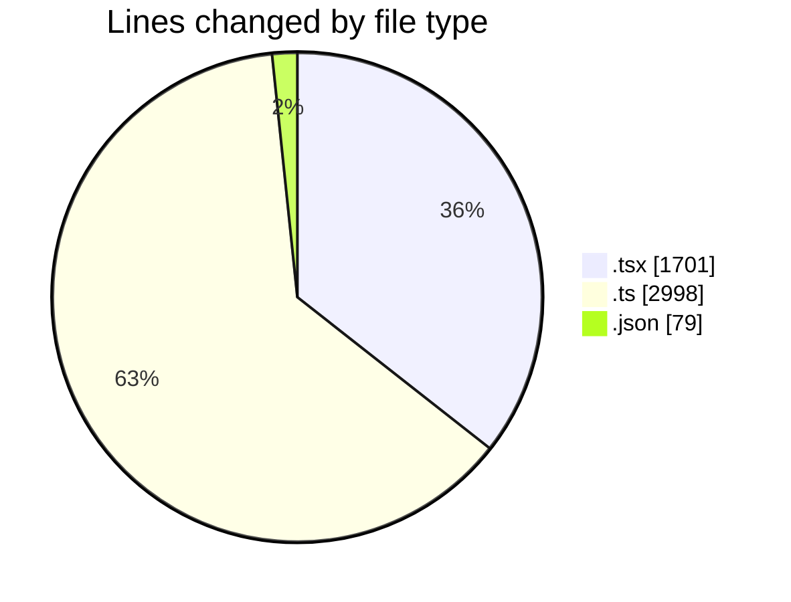
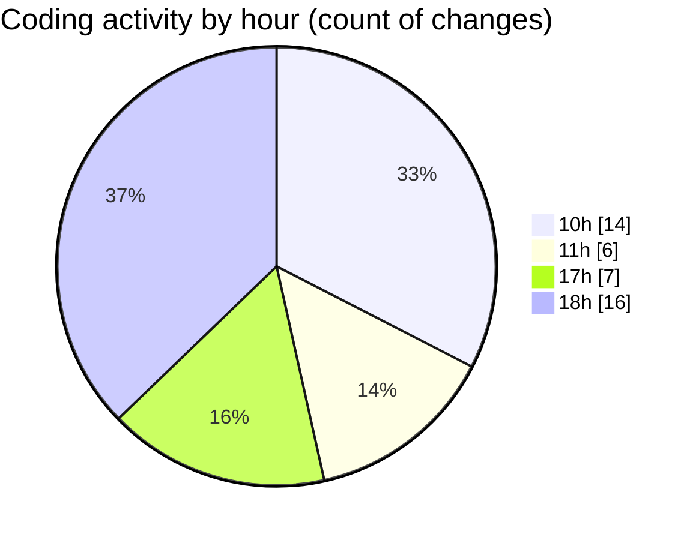

# nxtqube_webapp - Activity Summary 

## Overall Statistics

| Stat                   | Value                                                             |
| ---------------------- | ----------------------------------------------------------------- |
| **Lines Added** (➕)   | 4714                                          |
| **Lines Removed** (➖) | 64                                        |
| **Net Change** (↕)    | 4650                |
| **Active Time** (⌚)   | 48 minutes |

## Modified Files
- **MissionInfo.tsx** (+1241, -16)
- **mission.validator.ts** (+639, -27)
- **20260427-000021-seed-missions.ts** (+2328, -4)
- **package.json** (+79, -0)
- **createGridMission.tsx** (+427, -17)

## Visualizations

### By File Type (Lines Changed)

### By Hour (Estimated Activity Count)

> **Last Updated:** 03/05/2026, 19:01:49