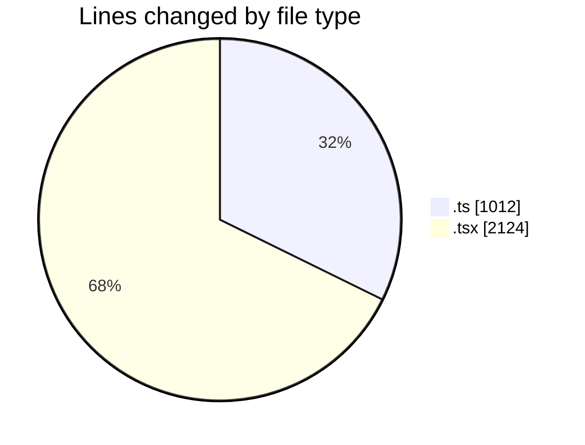
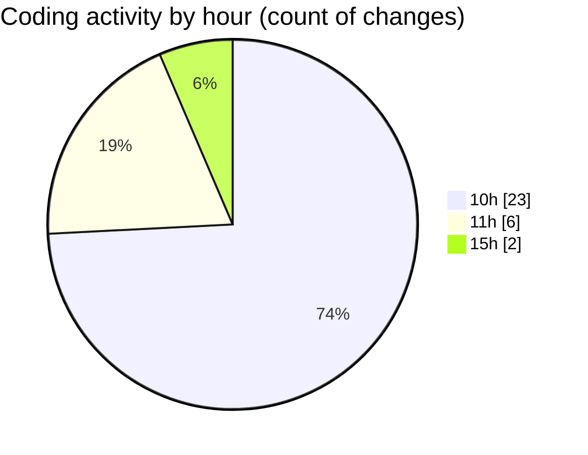

# nxtqube_webapp - Activity Summary 

## Overall Statistics

| Stat                   | Value                                                             |
| ---------------------- | ----------------------------------------------------------------- |
| **Lines Added** (➕)   | 3116                                          |
| **Lines Removed** (➖) | 20                                        |
| **Net Change** (↕)    | 3096                |
| **Active Time** (⌚)   | 44 minutes |

## Modified Files
- **useGridMission.ts** (+815, -15)
- **gridMissionUtils.ts** (+182, -0)
- **createGridMission.tsx** (+10, -5)
- **createPathMission.tsx** (+915, -0)
- **create3DMission.tsx** (+1194, -0)

## Visualizations

### By File Type (Lines Changed)

### By Hour (Estimated Activity Count)

> **Last Updated:** 04/05/2026, 15:59:00