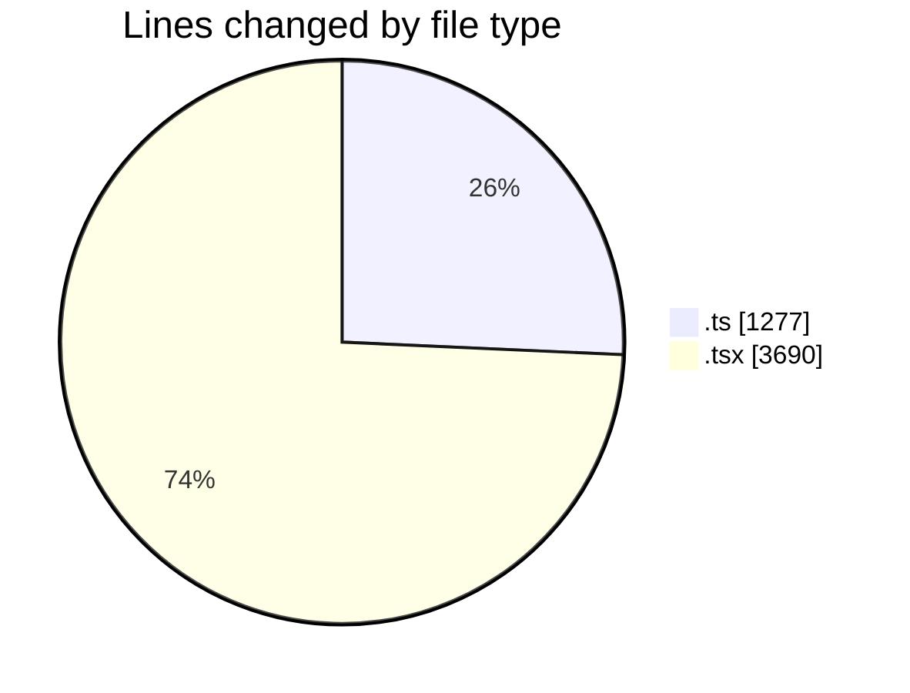
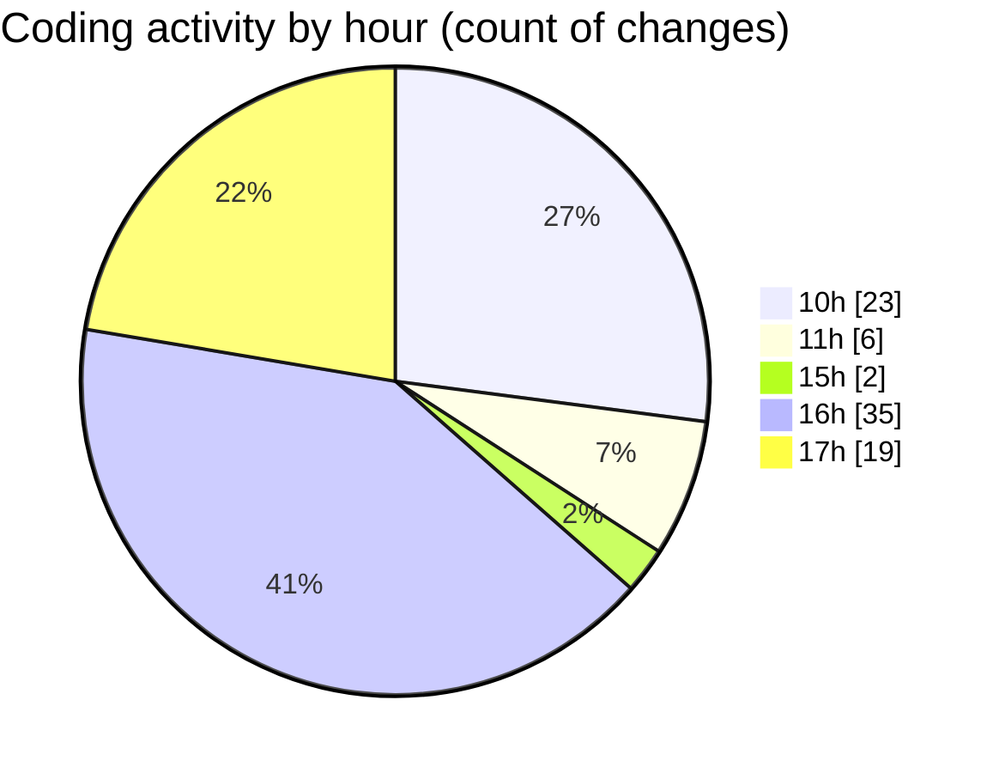

# nxtqube_webapp - Activity Summary 

## Overall Statistics

| Stat                   | Value                                                             |
| ---------------------- | ----------------------------------------------------------------- |
| **Lines Added** (➕)   | 4874                                          |
| **Lines Removed** (➖) | 93                                        |
| **Net Change** (↕)    | 4781                |
| **Active Time** (⌚)   | 104 minutes |

## Modified Files
- **useGridMission.ts** (+815, -15)
- **gridMissionUtils.ts** (+182, -0)
- **createGridMission.tsx** (+10, -5)
- **createPathMission.tsx** (+1830, -1)
- **create3DMission.tsx** (+1251, -57)
- **MissionActions.tsx** (+34, -0)
- **Existing.tsx** (+491, -11)
- **useMissions.ts** (+92, -2)
- **mission.action.ts** (+169, -2)

## Visualizations

### By File Type (Lines Changed)

### By Hour (Estimated Activity Count)

> **Last Updated:** 04/05/2026, 17:35:07