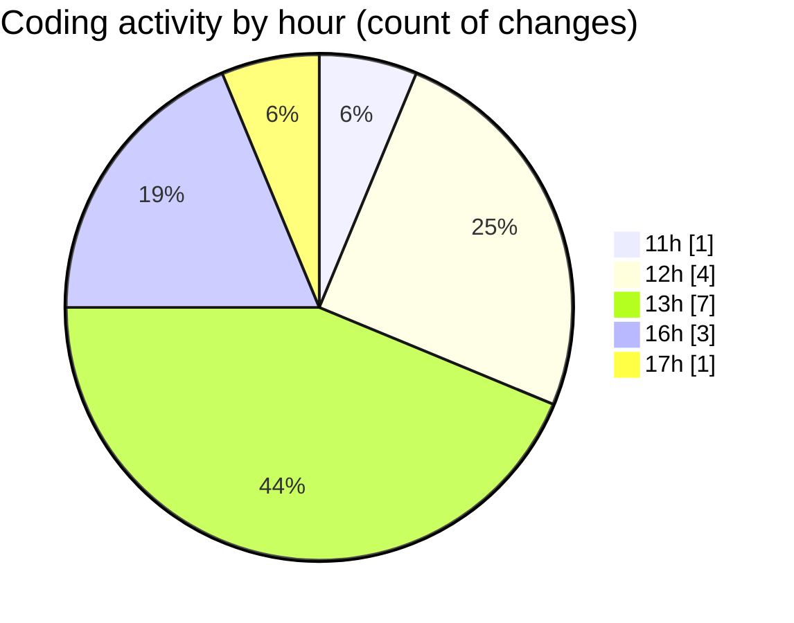

# nxtqube_webapp - Activity Summary 

## Overall Statistics

| Stat                   | Value                                                             |
| ---------------------- | ----------------------------------------------------------------- |
| **Lines Added** (➕)   | 1125                                          |
| **Lines Removed** (➖) | 697                                        |
| **Net Change** (↕)    | 428                |
| **Active Time** (⌚)   | 27 minutes |

## Modified Files
- **geogence.create.tsx** (+345, -693)
- **use.polygon.geofence.ts** (+526, -4)
- **geogence.list.tsx** (+254, -0)

## Visualizations

### By File Type (Lines Changed)

### By Hour (Estimated Activity Count)

> **Last Updated:** 12/05/2026, 17:02:06