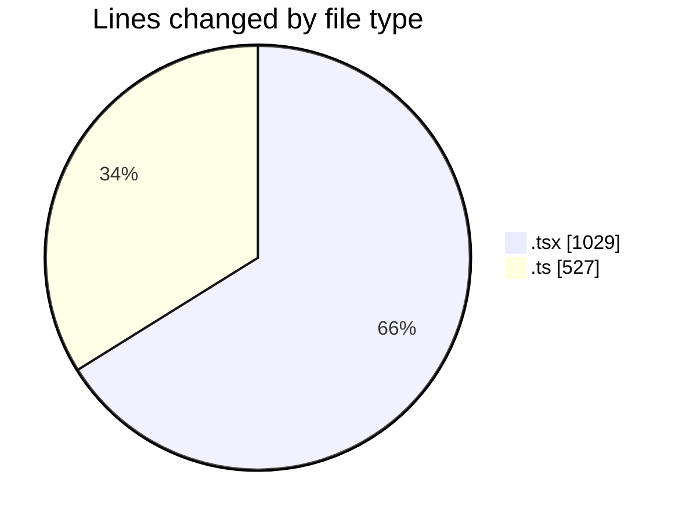
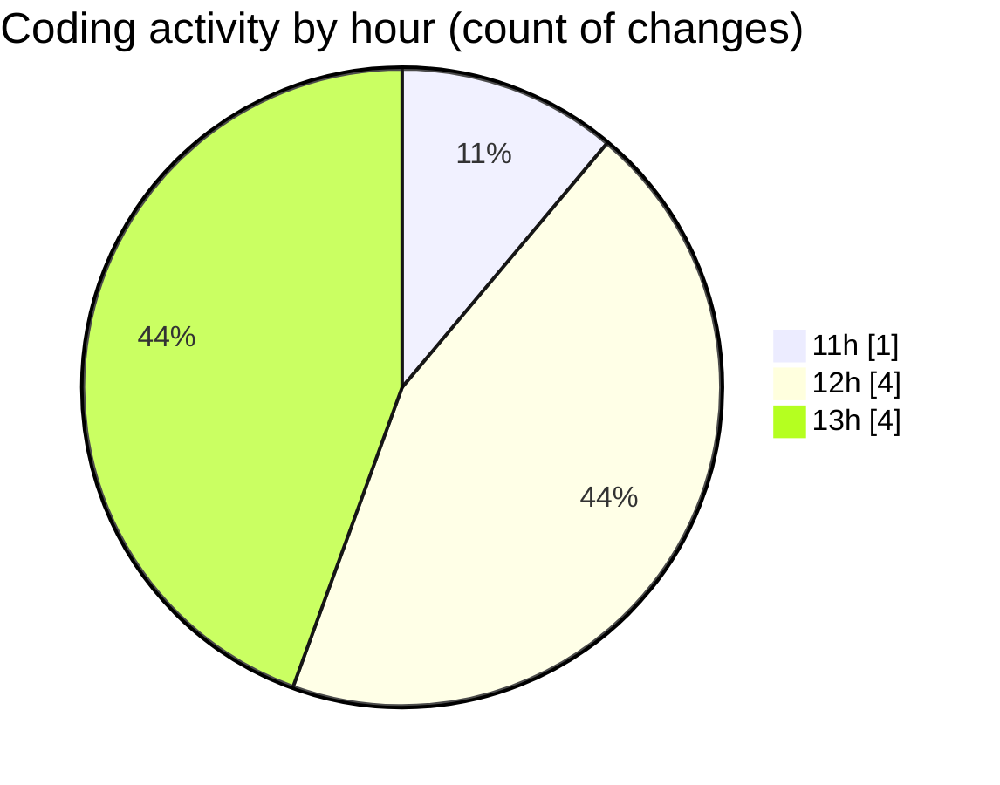

# nxtqube_webapp - Activity Summary 

## Overall Statistics

| Stat                   | Value                                                             |
| ---------------------- | ----------------------------------------------------------------- |
| **Lines Added** (➕)   | 867                                          |
| **Lines Removed** (➖) | 689                                        |
| **Net Change** (↕)    | 178                |
| **Active Time** (⌚)   | 11 minutes |

## Modified Files
- **geogence.create.tsx** (+343, -686)
- **use.polygon.geofence.ts** (+524, -3)

## Visualizations

### By File Type (Lines Changed)

### By Hour (Estimated Activity Count)

> **Last Updated:** 12/05/2026, 13:13:24