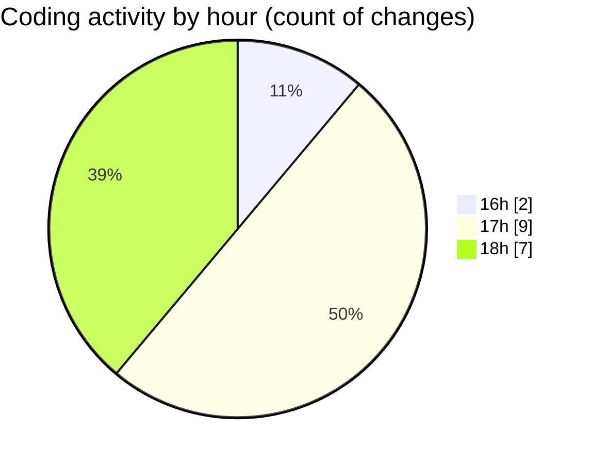

# nxtqube_webapp - Activity Summary 

## Overall Statistics

| Stat                   | Value                                                             |
| ---------------------- | ----------------------------------------------------------------- |
| **Lines Added** (➕)   | 2110                                          |
| **Lines Removed** (➖) | 44                                        |
| **Net Change** (↕)    | 2066                |
| **Active Time** (⌚)   | 24 minutes |

## Modified Files
- **create3DMission.tsx** (+1199, -43)
- **StackMission3D.tsx** (+660, -0)
- **draw.stack.boundry.ts** (+251, -1)

## Visualizations

### By File Type (Lines Changed)

### By Hour (Estimated Activity Count)

> **Last Updated:** 14/05/2026, 18:59:35