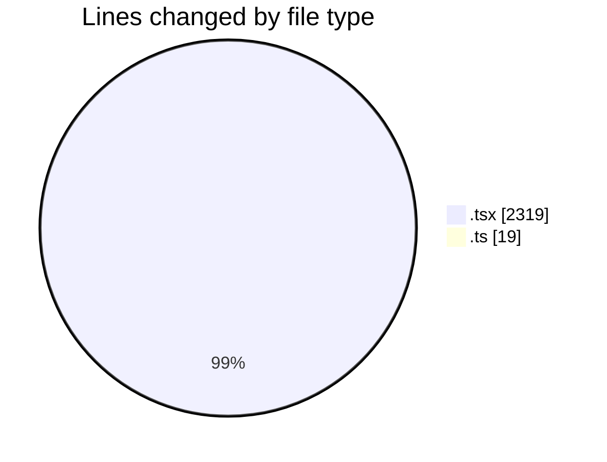
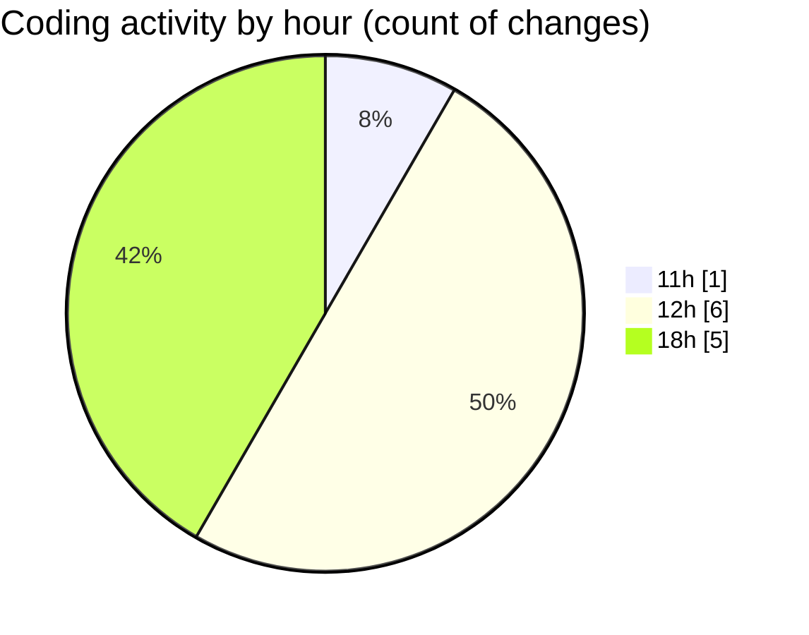

# nxtqube_webapp - Activity Summary 

## Overall Statistics

| Stat                   | Value                                                             |
| ---------------------- | ----------------------------------------------------------------- |
| **Lines Added** (➕)   | 2316                                          |
| **Lines Removed** (➖) | 22                                        |
| **Net Change** (↕)    | 2294                |
| **Active Time** (⌚)   | 8 minutes |

## Modified Files
- **create3DMission.tsx** (+1171, -7)
- **use.polygon.geofence.ts** (+4, -15)
- **StackMissionControl.tsx** (+1141, -0)

## Visualizations

### By File Type (Lines Changed)

### By Hour (Estimated Activity Count)

> **Last Updated:** 17/05/2026, 18:13:56