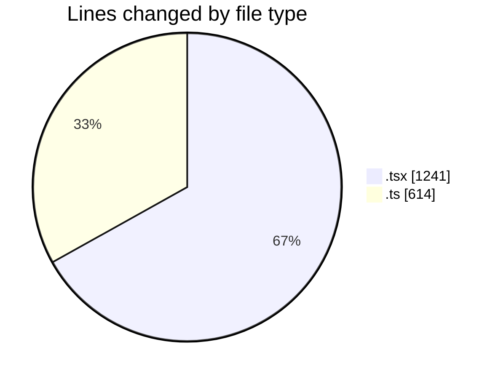
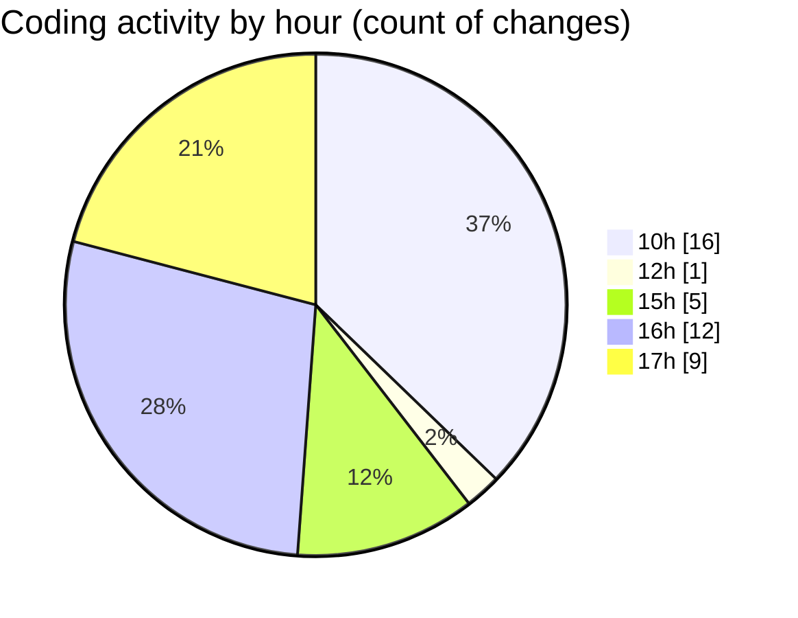

# nxtqube_webapp - Activity Summary 

## Overall Statistics

| Stat                   | Value                                                             |
| ---------------------- | ----------------------------------------------------------------- |
| **Lines Added** (➕)   | 1746                                          |
| **Lines Removed** (➖) | 109                                        |
| **Net Change** (↕)    | 1637                |
| **Active Time** (⌚)   | 67 minutes |

## Modified Files
- **create3DMission.tsx** (+71, -16)
- **StackMissionControl.tsx** (+34, -0)
- **mission.model.ts** (+2, -0)
- **mission.validator.ts** (+612, -0)
- **OrbitMission3D.tsx** (+274, -63)
- **StackMission3D.tsx** (+753, -30)

## Visualizations

### By File Type (Lines Changed)

### By Hour (Estimated Activity Count)

> **Last Updated:** 18/05/2026, 17:09:10