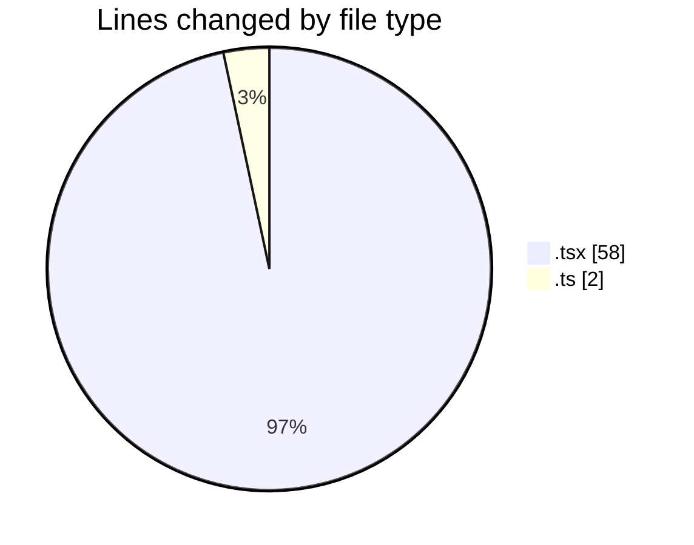
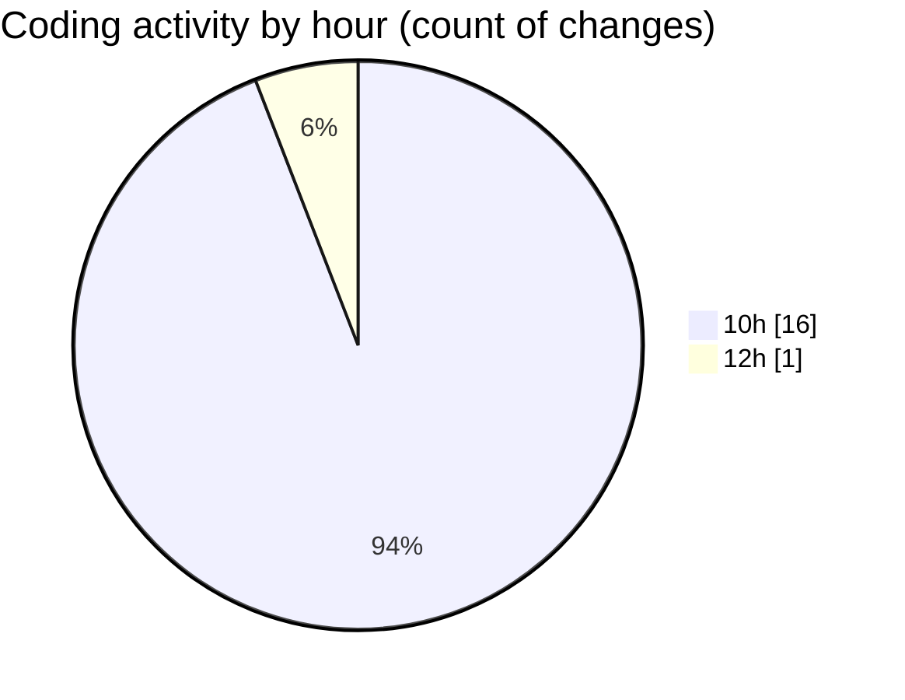

# nxtqube_webapp - Activity Summary 

## Overall Statistics

| Stat                   | Value                                                             |
| ---------------------- | ----------------------------------------------------------------- |
| **Lines Added** (➕)   | 59                                          |
| **Lines Removed** (➖) | 1                                        |
| **Net Change** (↕)    | 58                |
| **Active Time** (⌚)   | 23 minutes |

## Modified Files
- **create3DMission.tsx** (+23, -1)
- **StackMissionControl.tsx** (+34, -0)
- **mission.model.ts** (+2, -0)

## Visualizations

### By File Type (Lines Changed)

### By Hour (Estimated Activity Count)

> **Last Updated:** 18/05/2026, 12:35:13