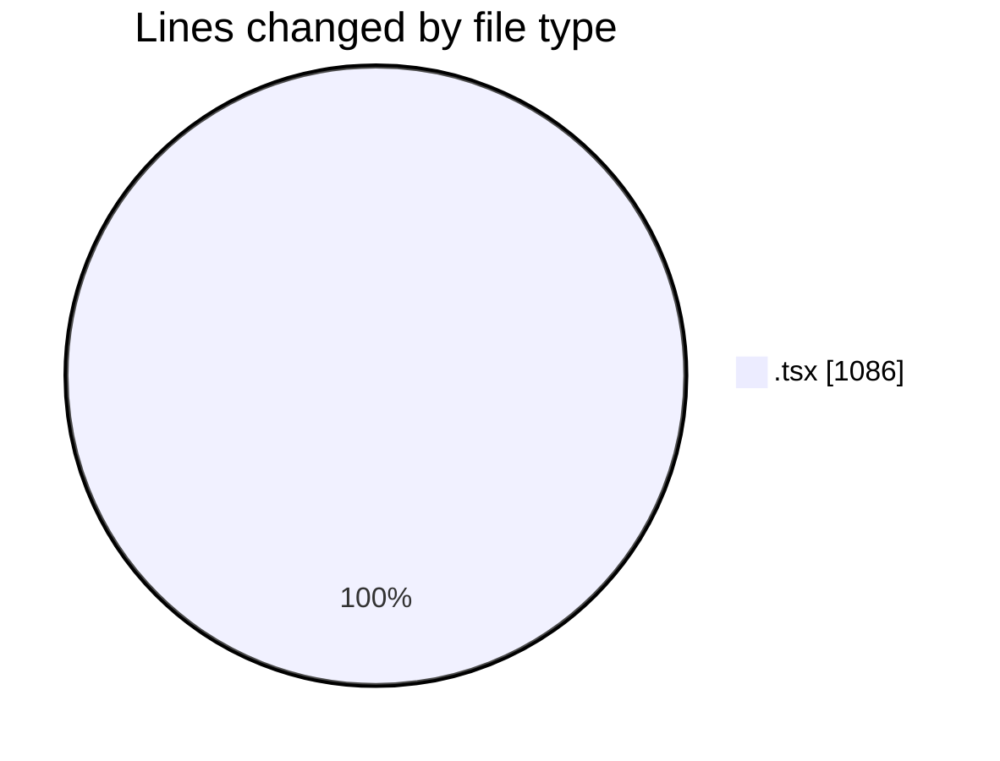
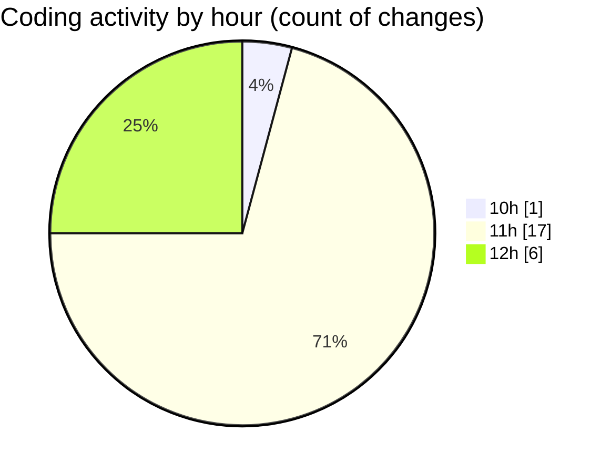

# nxtqube_webapp - Activity Summary 

## Overall Statistics

| Stat                   | Value                                                             |
| ---------------------- | ----------------------------------------------------------------- |
| **Lines Added** (➕)   | 1078                                          |
| **Lines Removed** (➖) | 8                                        |
| **Net Change** (↕)    | 1070                |
| **Active Time** (⌚)   | 31 minutes |

## Modified Files
- **StackMission3D.tsx** (+0, -1)
- **StackMissionControl.tsx** (+35, -0)
- **OrbitMissionControl.tsx** (+688, -0)
- **create3DMission.tsx** (+233, -5)
- **MissionModeSelector.tsx** (+75, -0)
- **OrbitMission3D.tsx** (+47, -2)

## Visualizations

### By File Type (Lines Changed)

### By Hour (Estimated Activity Count)

> **Last Updated:** 19/05/2026, 12:10:14