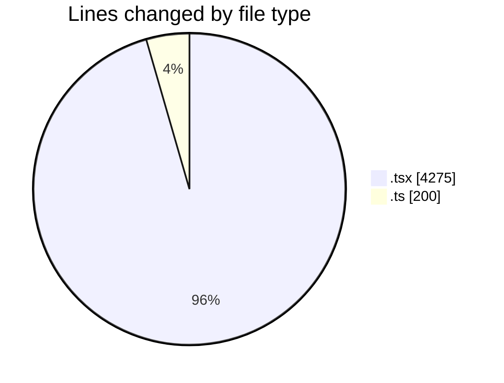
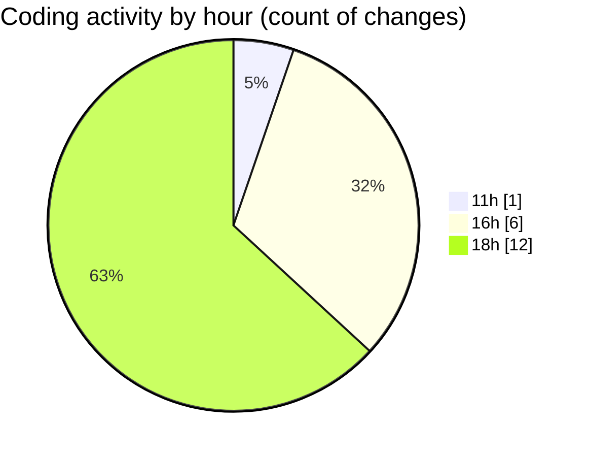

# nxtqube_webapp - Activity Summary 

## Overall Statistics

| Stat                   | Value                                                             |
| ---------------------- | ----------------------------------------------------------------- |
| **Lines Added** (➕)   | 4473                                          |
| **Lines Removed** (➖) | 2                                        |
| **Net Change** (↕)    | 4471                |
| **Active Time** (⌚)   | 21 minutes |

## Modified Files
- **LaunchControl.tsx** (+380, -0)
- **MissionControls.tsx** (+713, -2)
- **create3DMission.tsx** (+1496, -0)
- **MissionInfo.tsx** (+1238, -0)
- **createGridMission.tsx** (+446, -0)
- **missionDataHandler.ts** (+200, -0)

## Visualizations

### By File Type (Lines Changed)

### By Hour (Estimated Activity Count)

> **Last Updated:** 24/05/2026, 18:59:16