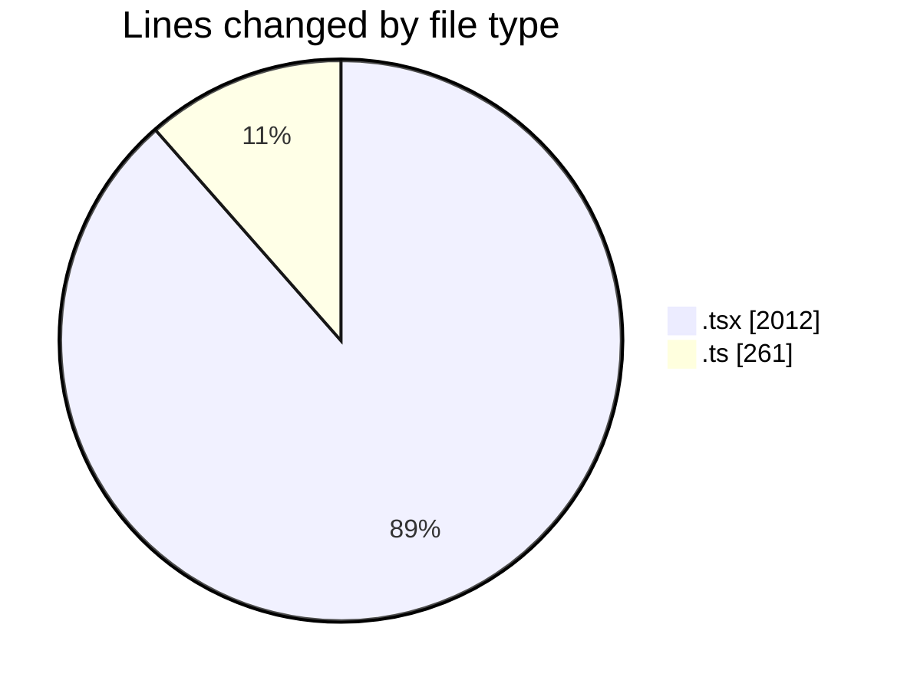
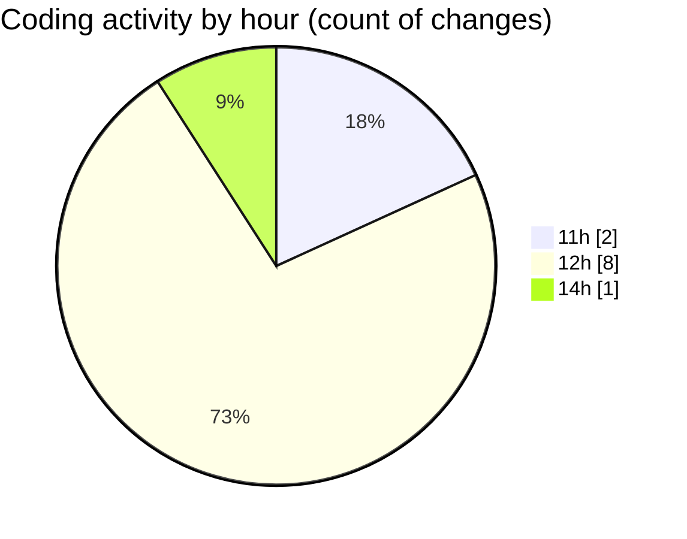

# nxtqube_webapp - Activity Summary 

## Overall Statistics

| Stat                   | Value                                                             |
| ---------------------- | ----------------------------------------------------------------- |
| **Lines Added** (➕)   | 2256                                          |
| **Lines Removed** (➖) | 17                                        |
| **Net Change** (↕)    | 2239                |
| **Active Time** (⌚)   | 9 minutes |

## Modified Files
- **createGridMission.tsx** (+489, -17)
- **create3DMission.tsx** (+1506, -0)
- **draw.stack.boundry.ts** (+261, -0)

## Visualizations

### By File Type (Lines Changed)

### By Hour (Estimated Activity Count)

> **Last Updated:** 25/05/2026, 15:14:50