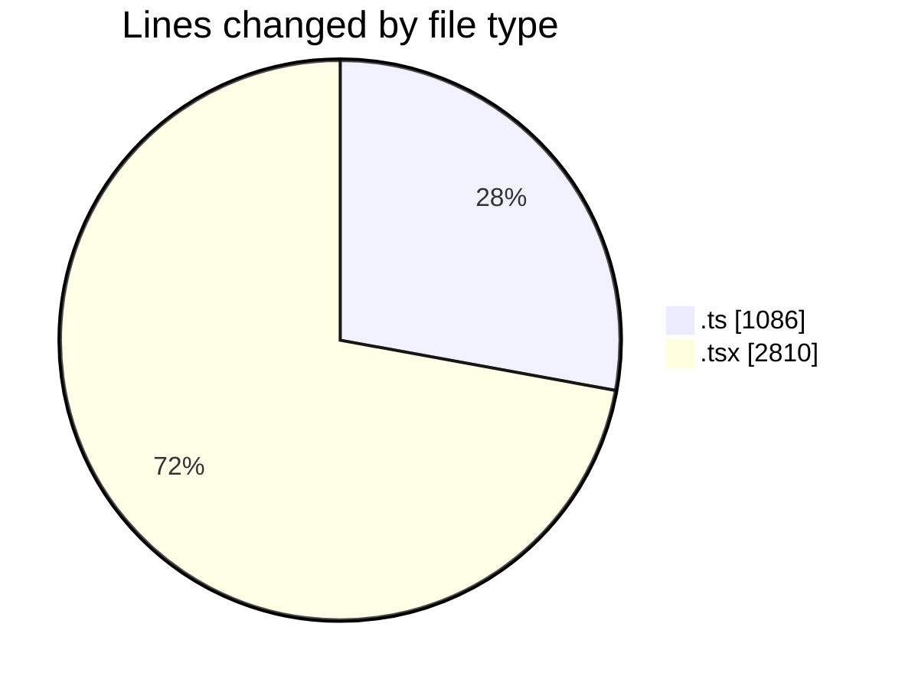
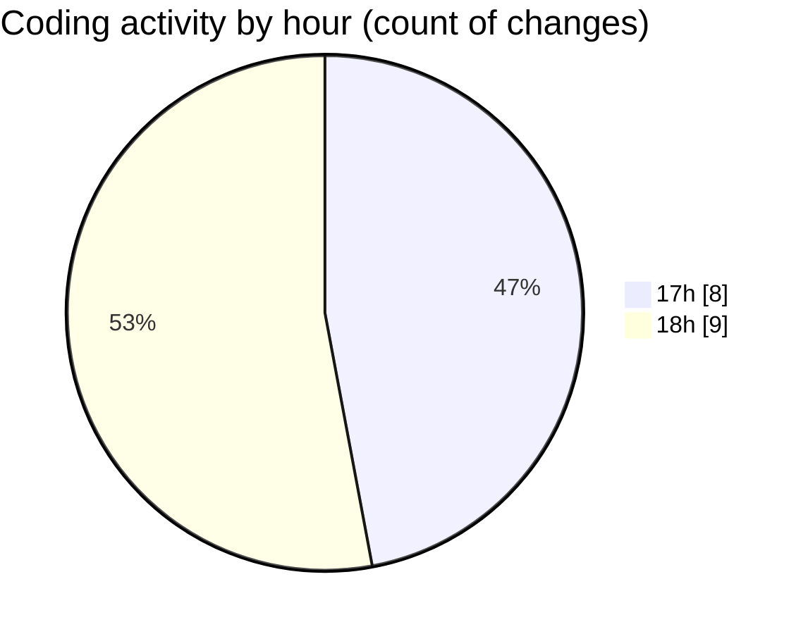

# nxtqube_webapp - Activity Summary 

## Overall Statistics

| Stat                   | Value                                                             |
| ---------------------- | ----------------------------------------------------------------- |
| **Lines Added** (➕)   | 3879                                          |
| **Lines Removed** (➖) | 17                                        |
| **Net Change** (↕)    | 3862                |
| **Active Time** (⌚)   | 15 minutes |

## Modified Files
- **flight.controller.ts** (+317, -6)
- **mission.validator.ts** (+624, -0)
- **index.ts** (+139, -0)
- **create3DMission.tsx** (+1642, -11)
- **createGridMission.tsx** (+515, -0)
- **ExistingMission.tsx** (+642, -0)

## Visualizations

### By File Type (Lines Changed)

### By Hour (Estimated Activity Count)

> **Last Updated:** 02/06/2026, 18:20:27